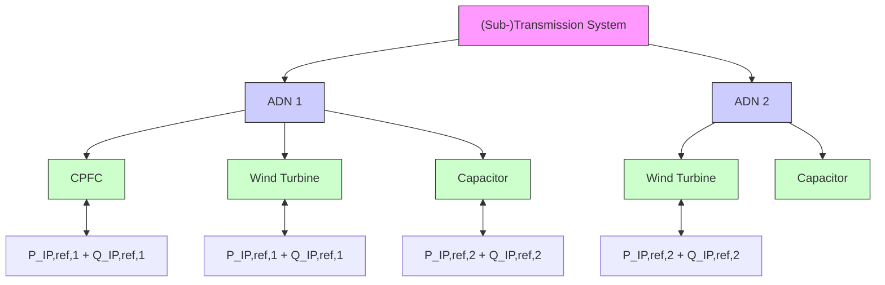

# II. CROSS-VOLTAGE-LEVEL POWER FLOW CONTROL IN ACTIVE DISTRIBUTION NETWORKS

An ADN is a distribution grid whose network state can be adjusted by DERs. This property allows ADNs to provide ancillary services at the ADN’s interconnection point to the next higher voltage level as illustrated in Fig. 1. The provision of ancillary services by ADNs has recently been the subject of numerous publications. Many approaches like [9]–[12] are based on optimal power flow calculations or model predictive control. In contrast, in [3], [5]–[7], PI-based ADN control concepts are presented. These ADNs are characterized by a CPFC that allows the real-time control of the ADN’s power flow at the interconnection point to the next higher voltage level.

flowchart

Fig. 1: Active Distribution Network with Cross-Voltage-Level Power Flow Control in accordance with [4]

ADNs can be utilized for time-critical ancillary services in the emergency state where the tolerable response of the CPFC lies within seconds to minutes, such as:

• Reactive / curative redispatch   
• Frequency control (via provision of active power control by the underlying ADNs)   
• Voltage control in transmission systems (via provision of reactive power control by the underlying ADNs)

The structure of the CPFC can be different. In [3], [6], the PI-Controller is implemented decentralized in each DER, whereas in [5], [7], the controller is implemented centralized in the ADN. In an adaptive system, the central implementation has the advantage that only one controller needs to be adjusted.
