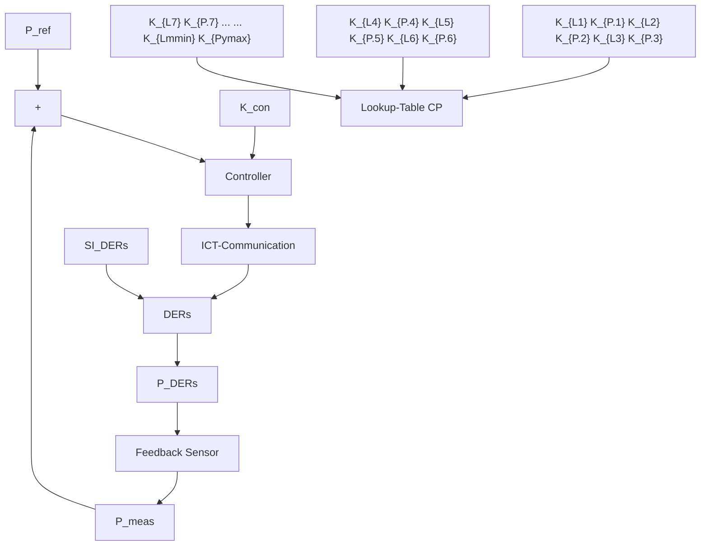

# III. DEVELOPMENT AND STRUCTURE OF THE ADAPTIVE CONTROL SYSTEM

This section describes the development and structure of the adaptive control system. The actuators of the control loop are the DERs connected to the ADN. For the reasons mentioned in Section I, the availability of DERs changes over time. Theoretically, the set of actuators available to the control system can adopt any possible combination of DERs which participate in ADN’s CPFC. Thus, the plant model of the ADN is a time-variant system, which can be described by a family of time-invariant systems. In order to meet this challenge, a gain scheduling approach is used. Common use cases of gain scheduling are nonlinear systems like linear parametervarying systems [19], [20]. In these approaches, the system’s operating range is divided into regions where linear control is adequate. For each region, a linear controller is designed. In [21], [22], gain scheduling is also applied for time-variant systems, whereby the gain scheduling approach compensates the time-variance. Also in this work, the gain scheduling approach is used to compensate the time variance and not a nonlinear behavior.

For each possible set of actuators $A _ { n } ,$ , individual control parameters $K _ { \mathrm { P } }$ and $K _ { \mathrm { I } }$ are calculated in advance and saved in a lookup table CP . In order to choose the proper control parameters of $C P ,$ the control system has to know which DERs are available at all times. For this reason, the control system must regularly query the availability of the DERs.

Without any knowledge of the dynamic properties of the DERs that participate in the control loop, the plant model is a black box. The effort to create detailed models of the DERs for a white box approach is disproportionate. Therefore a grey box approach, which is a good trade-off between effort and accuracy, is chosen in this paper. After the structure of the adaptive control system is explained in Section III-A, a reference control loop model is created in Section III-B by means of some data of the DERs. Finally, the reference control loop model is used to determine the parameters of the lookup table CP in Section III-C.

flowchart

Fig. 2: Control structure of the adaptive control system
