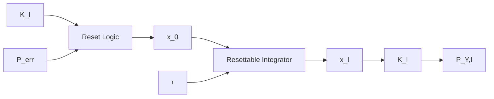

The lookup table $C P$ of the gain scheduling based adaption mechanism contains one pair of the control parameters $K _ { \mathrm { I } , n }$ and $K _ { \mathrm { P } , n }$ (summarized as $K _ { \mathrm { c o n } } )$ for each possible set of actuators $A _ { n } .$ . In order to choose the right parameter pair, the adaption mechanism has to know which DERs are available to the control system. The status information $S I _ { \mathrm { D E R } }$ s provides these data. The signal $S I _ { \mathrm { D E R s } }$ s contains a boolean for each DER d. The element d of $S I _ { \mathrm { D E R s } }$ s is zero if the DER d is unavailable and one if the DER d is available to the control system.

In order to avoid unwanted control errors by switching the control parameters, a reset logic is added to the control structure of the integral term. The reset logic, shown in $\operatorname { F i g }$ . 3, realizes a reset of the integrator so that the output value of the integral term $P _ { \mathrm { Y , I } }$ remains unchanged when switching the control parameters. For this purpose, the reset logic uses the state variable of the integrator $x _ { \mathrm { I } }$ and the specified integral control parameter of the adaption mechanism $K _ { \mathrm { I } }$ as input parameters.

flowchart

Fig. 3: Control structure extension to avoid control errors after control parameter switching

The output parameter $x _ { 0 }$ of the reset logic in discrete-time representation is determined by Eq. 2 to Eq. 4.

$$x _ {0, \text { inc }} ^ {(k)} = x _ {\mathrm{I}} ^ {(k - 1)} + x _ {\mathrm{I}} ^ {(k - 1)} \cdot (K _ {\mathrm{I}} ^ {(k - 1)} - K _ {\mathrm{I}} ^ {(k)}) \cdot K _ {\mathrm{I}} ^ {(k)} \tag {2}x _ {0, \text { dec }} ^ {(k)} = x _ {\mathrm{I}} ^ {(k - 1)} + x _ {\mathrm{I}} ^ {(k - 1)} \cdot \frac {K _ {\mathrm{I}} ^ {(k - 1)} - K _ {\mathrm{I}} ^ {(k)}}{K _ {\mathrm{I}} ^ {(k)}} \tag {3}
x _ {0} ^ {(k)} = \left\{ \begin{array}{l l} x _ {0, \text {   inc   }} ^ {(k)} & \text { if   } K _ {\mathrm{I}} ^ {(k)} > K _ {\mathrm{I}} ^ {(k - 1)} \\ x _ {0, \text {   dec   }} ^ {(k)} & \text { if   } K _ {\mathrm{I}} ^ {(k)} \leq K _ {\mathrm{I}} ^ {(k - 1)}. \end{array} \right. \tag {4}
$$

The parameter $x _ { \mathrm { I } } ^ { ( k - 1 ) }$ is the state variable of the integrator and K(k−1) i $K _ { \mathrm { I } } ^ { ( k - 1 ) }$ s the gain of the integral term immediately before the reset. The rising edge of the reset signal r, described by

$$
r = \left\{ \begin{array}{l l} 0 & \text { if } K _ {\mathrm{I}} ^ {(k)} = K _ {\mathrm{I}} ^ {(k - 1)} \\ 1 & \text { if } K _ {\mathrm{I}} \neq K _ {\mathrm{I}} ^ {(k - 1)}, \end{array} \right. \tag {5}
$$

triggers the integrator to apply $x _ { 0 } ^ { ( k ) }$ x0 as the new state variable x(k). $x _ { \mathrm { I } } ^ { ( \overline { { k } } ) }$
