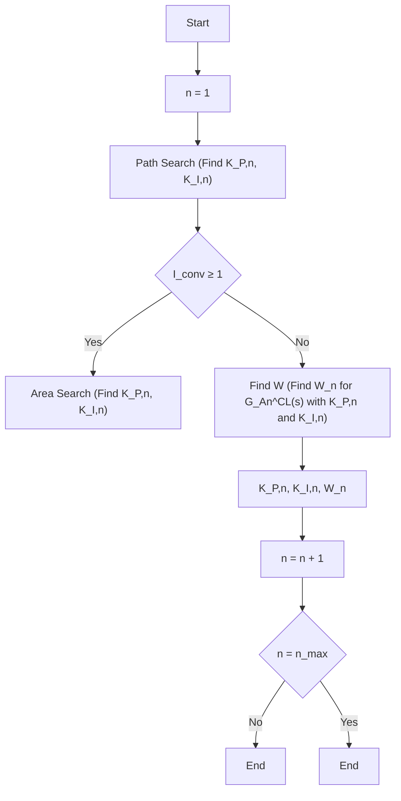

# C. Design of the Lookup Table

The reference control loop models are used to determine the elements of the lookup table CP . In doing so, the disk margin and overshoot are considered. Compared to the gain and phase margin, the disk margin is the stronger design criterion for robust control [24]. In order to create a highly robust system, the control parameters in $C P$ are tuned by the necessary condition disk margin $\geq 1 . 5$ . To get a smooth performance of the control loop, also overshooting $< 1 \%$ is considered as a necessary condition.

The feasible solution space (disk margin $\geq 1 . 5$ and overshooting $< 1 \% )$ for $K _ { \mathrm { P } }$ and $K _ { \mathrm { I } }$ of an exemplary reference control loop model is sketched in Fig. 6. The dark grey plane marks the non-feasible solutions. For the feasible solutions, the rise time $t _ { \mathrm { r } }$ is given on the z-axis. The goal is to find the feasible solution with the lowest rise time of every combination of DERs. For this purpose, an algorithm has been developed, which is explained in the following.

The inputs of the algorithm ar e P DER , $P _ { \mathrm { i n s t } , d } ^ { \mathrm { D E R } } , \ T _ { \mathrm { d e l a y } , d } ^ { \mathrm { D E R } } ,$ and T DER $T _ { \mathrm { r i s e } , d } ^ { \mathrm { D E R } }$ for each DER (compare Table I) and the outputs are $C P$ and a set of individual scaling factors $W _ { n }$ . The array $W _ { n }$ contains the scaling factors $w _ { a }$ for each DER a of a combination $A _ { n } .$ In the beginning, all arrays $W _ { n }$ contain only ones. The flowchart of the main function of the algorithm is shown in Fig. 4.

flowchart

Fig. 4: Flow chart of the main function for determining the lookup table $C P$ and the sets of scaling factors $W _ { n }$
