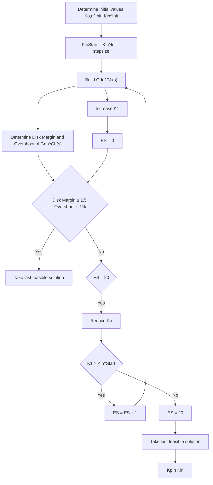

The algorithm successively searches the parameters $K _ { \mathrm { P } } .$ , $K _ { \mathrm { I } } ,$ , and $w _ { a }$ starting with the combination $A _ { 1 } \ ( n = 1 )$ . The main function contains the three sub-functions Path Search, Area Search, and Find W. Fig. 5 illustrates these three subfunctions. In addition, the procedures of the sub-functions Path Search and Area Search are marked in Fig. 6 in green. The sub-function Path Search is called first. In the beginning, the sub-function Path Search determines initial values of $K _ { \mathrm { P } }$ and


<details>
<summary>flowchart</summary>


</details>


<details>
<summary>flowchart</summary>

```mermaid
graph TD
    A["Take result of Path Search as starting point"] --> B["Increase K_i"]
    B --> C["Build G_A_n^CL(s)"]
    C --> D["Determine Disk Margin and Overshoot of G_A_n^CL(s)"]
    D --> E{Disk Margin ≤ 1.5 Overshoot ≤ 1%}
    E -->|No| F{K_p = 0}
    E -->|Yes| G{New solutions found}
    F -->|Yes| H["Take solution of Path Search"]
    F -->|No| I["Take solution with lowest Rise Time"]
    G -->|Yes| J["Take solution of Path Search"]
    G -->|No| K["Take solution with K_I,n"]
    H --> L["Save solution"]
    I --> L
    J --> L
    K --> L
    L --> M["K_{P,n}, K_{I,n}"]
    M --> N{K_i = K_{I,n}^{init}]
    N -->|No| O{K_p = 0}
    O -->|Yes| P["End"]
    O -->|No| Q["Reduce K_p"]
    Q --> R["End"]
    R --> S["Take solution with K_{P,n}, K_{I,n}"]
```
</details>


<details>
<summary>flowchart</summary>

```mermaid
graph TD
    A["a = 1"] --> B["w_a^init = 1"]
    B --> C["Build G_a^C(s)"]
    C --> D{Disk Margin ≤ 1.5 Overshoot ≤ 1%}
    D -->|No| E["Reduce w_a"]
    D -->|Yes| F["w_a"]
    F --> G{a = |A_n|}
    G -->|Yes| H["a = a + 1"]
    H --> C
```
</details>
