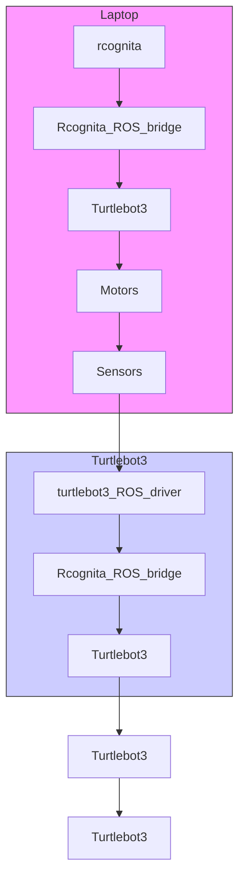

# B. Hardware and experiment setup

The hardware platform of the current study was a mobile wheeled robot Robotis TurtleBot 3 equipped with a lidar, an inertia measurement unit (IMU) for implementation of the linear and angular speed control, as well as for dead reckoning, which is also fused with the lidar data for position determination.

flowchart

Fig. 1: Flowchart of the interconnection of rcognita and Robotis TurtleBot 3, the robot used in the current study.

Experiments were run on a test polygon with concrete floor with markings of coordinate axes and 20 cm step nodes. The robot started in the center with a fixed orientation and drove to on of the target positions as shown in Fig. 2 (a).

For each running cost matrix H, 32 runs were performed, i. e., for each target position and, respectively, the nominal and CALF agents. The agent performance was evaluated by the accumulated running cost of 120 s, the total run time. The agent sampling time was set to 0.05 sec which was fairly sufficient for the real-time robot control. The results are presented in the next section.
