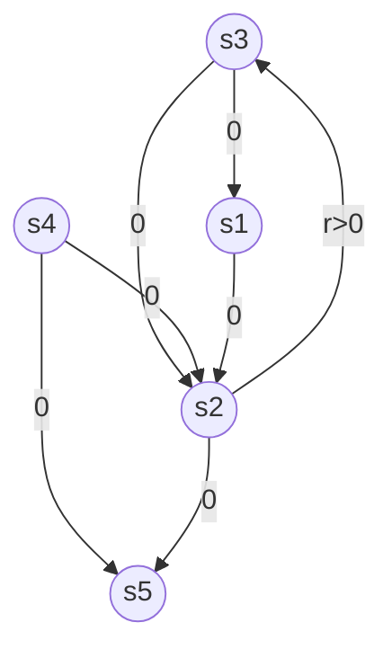

# F. Non-concavity of the Value function

We show here that the value function $V ^ { \pi } ( \rho )$ is in general non-concave, and hence standard convex optimization techniques for maximization may get stuck in local optima. We note once again that this is different from the non-concavity of $V ^ { \pi }$ when the parameterization is over the entire state-action space, $\mathrm { i . e . , } \mathbb { R } ^ { S \times A }$ .

We show here that for both SoftMax and direct parameterization, the value function is non-concave where, by “direct” parameterization we mean that the controllers $K _ { m }$ are parameterized by weights $\theta _ { m } \in \mathbb { R }$ , where $\theta _ { i } \geqslant 0 , \forall i \in [ M ]$ and $\sum _ { i = 1 } ^ { M } \theta _ { i } = 1$ . A similar argument holds for softmax parameterization, which we outline in Note F.2.

Lemma F.1. (Non-concavity of Value function) There is an MDP and a set of controllers, for which the maximization problem of the value function (i.e. (1)) is non-concave for SoftMax parameterization, $i . e . , \theta \mapsto V ^ { \pi _ { \theta } }$ is non-concave.

flowchart

Figure 6: An example of an MDP with controllers as defined in (7) having a non-concave value function. The MDP has $S = 5$ states and $A = 2$ actions. States $s _ { 3 } , s _ { 4 }$ and $s _ { 5 }$ are terminal states. The only transition with nonzero reward is $s _ { 2 } \to s _ { 4 }$ .

Proof. Consider the MDP shown in Figure 6 with 5 states, $s _ { 1 } , \ldots , s _ { 5 }$ . States $s _ { 3 } , s _ { 4 }$ and $s _ { 5 }$ are terminal states. In the figure we also show the allowed transitions and the rewards obtained by those transitions. Let the action set A consists of only three actions $\{ a _ { 1 } , a _ { 2 } , a _ { 3 } \} \equiv \{ \mathrm { r i g h t , u p , n u l 1 } \}$ , where ’null’ is a dummy action included to accommodate the three terminal states. Let us consider the case when $M = 2$ . The two controllers $K _ { i } \in \mathbb { R } ^ { S \times A } , i = 1 , 2$ (where each row is probability distribution over A) are shown below.
