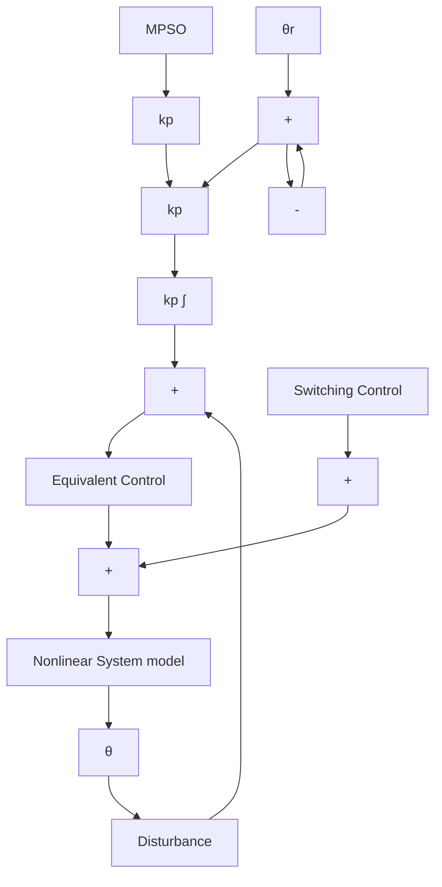

# 3.3.2. Candidate Lyapunov function

$$V (t) = 1 / _ {2} s ^ {2} = > \dot {V} (t) = s \dot {s} \tag {3.27}$$

On substituting,

$$\dot {V} (t) = s \left| - k s - k _ {s c} \right| s \left| ^ {\alpha}. s a t (s) \right| \tag {3.28}\dot {V} (t) = - k s ^ {2} - k _ {s c} | s | ^ {\beta}. \tag {3.29}$$

So $\dot { V } ( t ) < 0$ because $> 0 , k _ { s c } > 0$ , verifying the condition that the PID sliding mode surface exist and can reach under the control law.

flowchart

Figure 3.1 Description of the nonlinear system based on sliding mode control.
