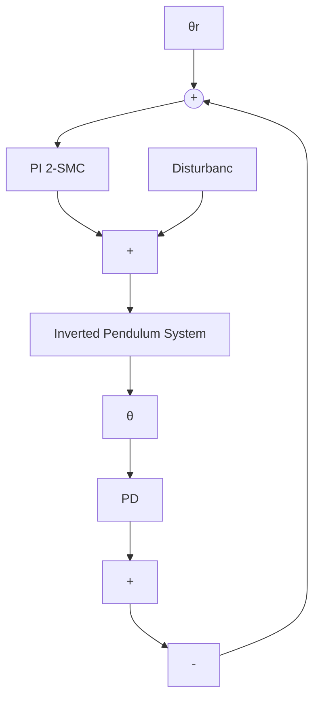

# 4.5 Controller design

Consider an Inverted pendulum system, considered for the swing-up and stabilization case. Control to the system is applied by means of the force ‘u’ to the cart, shown in Figure 1. Applying the Lagrange’s method, the systems nonlinear equation of motion obtained as

$$\ddot {\theta} = \frac {m g l \sin (\theta) - m ^ {2} l ^ {2} \cos (\theta) \sin (\theta) \dot {\theta} ^ {2} + u . m l \cos (\theta)}{m ^ {2} l ^ {2} \cos^ {2} (\theta) - (I + m l ^ {2})} \tag {4.20}$$

Consider $x _ { 1 }$ and $x _ { 2 }$ as pendulum angle and pendulum velocity respectively. Therefore,

$$
\left\{ \begin{array}{c} \dot {x _ {1}} = x _ {2} \\ \dot {x _ {2}} = \frac {m g l \sin x _ {1} - m ^ {2} l ^ {2} \cos x _ {1} \sin x _ {1} x _ {2} {} ^ {2} + u . m l \cos x _ {1}}{m ^ {2} l ^ {2} \cos^ {2} x _ {1} - (l + \mathrm{ml} ^ {2})} \end{array} \right. \tag {4.21}
$$

The main aim is to balance the pendulum upwards to a position desirable for the experiment and to maintain the position without letting it fall. The cart is driven by the dc motor, controlled by a controller. A disturbance force is applied on the top of the position.

flowchart

Figure 4.1 Block diagram of Inverted Pendulum System with Sliding mode controller
