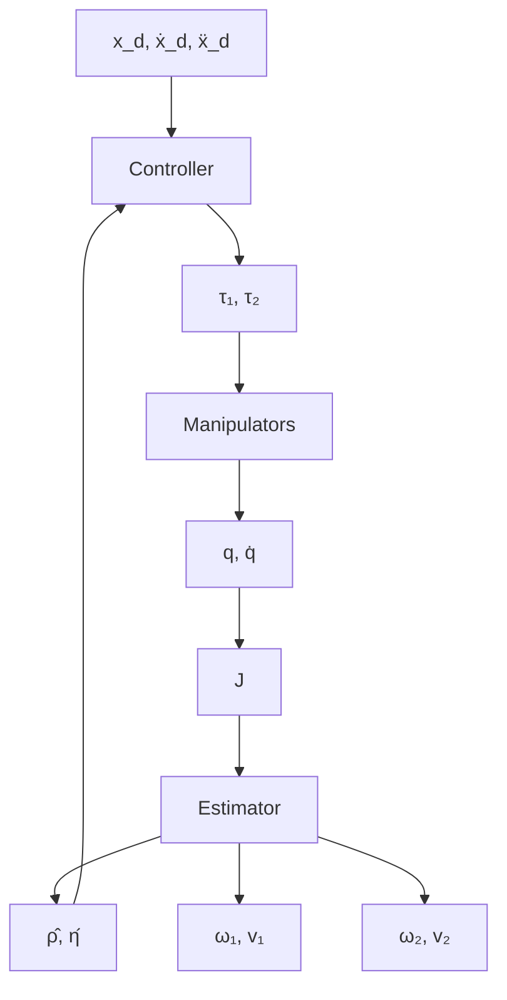

$$\hat {\boldsymbol {\rho}} _ {k + 1} = \hat {\boldsymbol {\rho}} _ {k} + \boldsymbol {K} _ {k} \left(\boldsymbol {v} _ {2 _ {k}} - \boldsymbol {A} (\hat {\boldsymbol {\eta}} _ {k}) \boldsymbol {v} _ {1 _ {k}} - \boldsymbol {\omega} _ {2 _ {k}} \times \hat {\boldsymbol {\rho}} _ {k}\right) \tag {18}$$

where the estimator gain is updated according to

$$\boldsymbol {K} _ {k} = - \boldsymbol {P} _ {k} [ \boldsymbol {\omega} _ {2 _ {k}} \times ] (\varrho \boldsymbol {I} - [ \boldsymbol {\omega} _ {2 _ {k}} \times ] \boldsymbol {P} _ {k} [ \boldsymbol {\omega} _ {2 _ {k}} \times ]) ^ {- 1}\boldsymbol {P} _ {k + 1} = \frac {1}{\varrho} \left(\boldsymbol {I} - \boldsymbol {K} _ {k} \left[ \omega_ {2 _ {k}} \times \right]\right) \boldsymbol {P} _ {k} \tag {19}$$

and scalar $\varrho$ was defined in (14); see Appendix 3.

If regressor $\left[ \omega _ { \mathrm { 2 } } \times \right]$ satisfies the persistently exciting condition, then estimator (18) is convergent. The persistent excitation condition dictates there exists $p > 1$ such that

$$\boldsymbol {\Pi} = \sum_ {i = k} ^ {k + p} - [ \boldsymbol {\omega} _ {2 _ {i}} \times ] ^ {2} > 0 \quad \forall k > 0 \tag {20}$$

Proposition 2 If the direction of the angular velocity vector does not remain constant over the time interval $\left[ \begin{array} { l l l } { t _ { k } } & { t _ { k + p } } \end{array} \right]$ , then the persistent excitation condition (20) is satisfied and estimator (18) is convergent, i.e., $\hat { \rho }  \rho$ as $t \to \infty$ .

Proof: Matrix $- [ { \boldsymbol { \omega } } _ { 2 _ { i } } \times ] ^ { 2 } \geq 0$ is rank deficient and hence it is positive semi-definite but not positive definite. This is because for any vector $\omega \in \mathbb { R } ^ { 3 }$ we have

$$\mathrm{eigenvaluesof} - [ \pmb {\omega} \times ] ^ {2} := \{0, \| \pmb {\omega} \| ^ {2} \}.$$

Although matrix $- [ \omega _ { 2 _ { i } } \times ] ^ { 2 }$ is singular at every instance of time, the persistent excitation condition requires that its integral over an interval of length $[ t _ { k } , \ t _ { k + p } ]$ be uniformly positive definite.

flowchart

