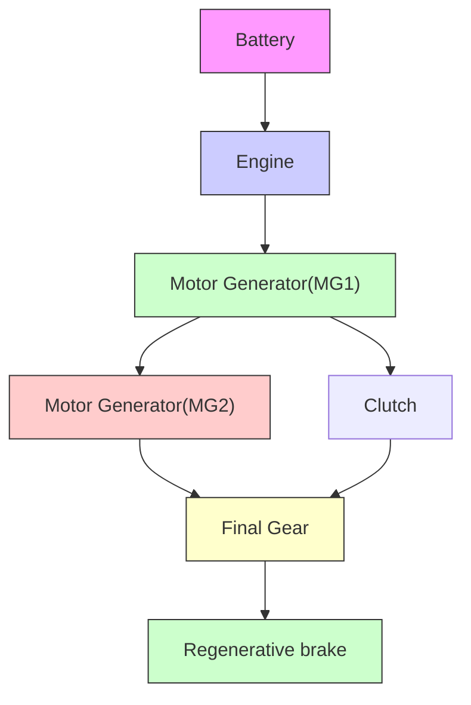

# 2. MIMO CONTROL IN A MULTI-MODE PHEV

The architecture of the multi-mode PHEV studied in this paper is shown in Fig. 1. The motor generator (MG1) and the engine work together to keep the battery's SoC constant for longer driving distances, and the other motor (MG2) and engine are the power sources to drive and brake the vehicle. The multi-mode PHEV has different working modes through different mechanical connections like clutch, including series hybrid mode, parallel hybrid mode, series-parallel hybrid mode, and regenerative brake as shown in Fig. 1 with different color lines to achieve the charge-sustaining, which makes the EMS more complicated.

flowchart

Fig. 1 Configuration of the multi-mode HEV powertrain
