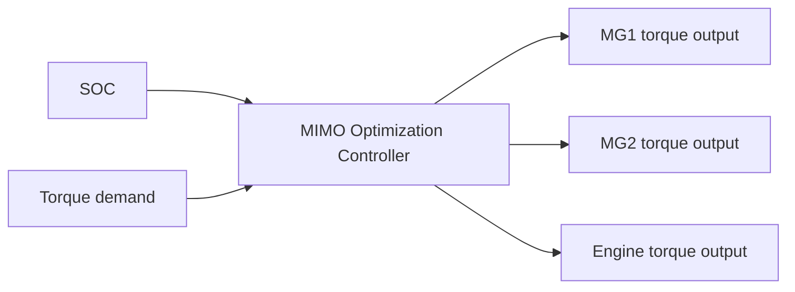

# 2.2 The multiple inputs and multiple-output (MIMO) energy management controller

As illustrated in Fig.2. the energy flow of the studied vehicle is managed by a multiple inputs and multipleoutput (MIMO) controller. By observing the battery Soc and the overall torque demand as the control inputs, the MIMO controller calculates the torque demands for MG1, MG2, and the engine, respectively, to general sufficient torque to drive the vehicle while maintaining the battery SoC.

flowchart

Fig. 2 MIMO control architecture

The work process of the MIMO controller is to resolve an optimization problem defined as follows：

$$\text { Minimize } P _ {\text { loss }} (\boldsymbol {u} _ {\text { mot1 }}, \boldsymbol {u} _ {\text { mot2 }}, T _ {\text { dem }}) \text { and } \Delta S O C (\boldsymbol {u} _ {\text { mot1 }}, \boldsymbol {u} _ {\text { mot2 }}, T _ {\text { dem }})
s. t. \left\{ \begin{array}{c} L o s s _ {e n g} (t) = m _ {f} ^ {\cdot} (t) \cdot H _ {f} - \frac {n _ {e n g} (t) \cdot T _ {e n g} (t)}{9 5 5 0} \\ L o s s _ {b a t t} (t) = R \cdot I _ {b a t t} (t) ^ {2} \\ S o C (t) = S o C (0) - \frac {\int_ {0} ^ {t} I _ {b a t t} (t) d t}{Q _ {b a t t}} \\ S o C ^ {-} \leq S o C (t) \leq S o C ^ {+} \\ a n d o t h e r p h y s i c a l c o n s t r a i n t s \end{array} \right. \tag {11}
$$

where, the overall power loss, $P _ { l o s s }$ , and the SoC difference, ∆??????, are two objectives which need to be minimized; the MG1 torque command, $u _ { m o t 1 } ( t )$ , and the MG2 torque command, $u _ { m o t 2 } ( t )$ , are the optimization variables to be determined during the realtime control; and the optimization should be subjected to the vehicle energy flow models and other physical constraints of the powertrain system and subsystems.
