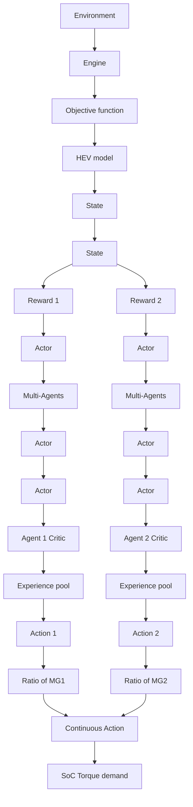

# 3.2 States and actions

In this study, both single-agent system and multiagent system monitor vehicle torque demands and battery SoC values as the state variables in a twodimensional vector space as

$$s (t) = \left[ T _ {d e m} (t), S o C (t) \right] \tag {12}$$

where $s ( t )$ is the current state at the $t ^ { t h }$ time step; $T _ { d e m } ( t )$ is the power demand value at the $t ^ { t h }$ step.

Since the single agent system can only output a single control action, $a _ { s } ( t )$ , this study uses the DDPG algorithm in the single system to compute the control command $u _ { m o t 1 } ( t )$ for MG1,

$$a _ {s} (t) = u _ {\text {mot1}} (t) \tag {13}$$

And the control commands $u _ { m o t 1 } ( t )$ and $u _ { m o t 2 } ( t )$ of MG1 and MG2, and the control command $u _ { e n g } ( t )$ of the engine can be calculated by

$$T _ {e n g} = u _ {m o t 1} (t) \cdot T _ {m o t 1 \_ m a x} + T _ {G B}T _ {d e m} = u _ {m o t 2} (t) \cdot T _ {m o t 2 \_ m a x} + T _ {e n g} \tag {14}u _ {e n g} (t) = \frac {u _ {m o t 1} (t) \cdot T _ {m o t 1 \_ m a x} + T _ {G B}}{T _ {e n g \_ m a x}}$$

flowchart

Fig.3. DDPG-based EMS with multi-agent learning

where, $T _ { m o t 1 \_ m a x }$ is the maximum torque of the MG1; $T _ { e n g \_ m a x }$ is the maximum torque that can be supplied by the engine; and $T _ { d e m }$ is the torque demand for driving and braking the vehicle; $T _ { G B }$ is the torque of the output shaft provided by the engine when MG2 output torque cannot meet the requirement of the total torque output.

For the proposed multi-agent system that has two DDPG agents, the actions as the output of the multiagent system can be

$$a _ {m} (t) = \left[ u _ {\text {mot1}} (t), u _ {\text {mot2}} (t) \right] \tag {15}$$

where $u _ { m o t 1 } ( t )$ is the output of the first DDPG agent for control of MG1 while $u _ { m o t 2 } ( t )$ is the output of the second DDPG agent for control of MG2. And the engine control command can be calculated using Eq.14 as well.

Both $a _ { s } ( t )$ and $a _ { m } ( t )$ are calculated following a rolling process of exploration and exploitation as defined in the DDPG algorithm [18].
