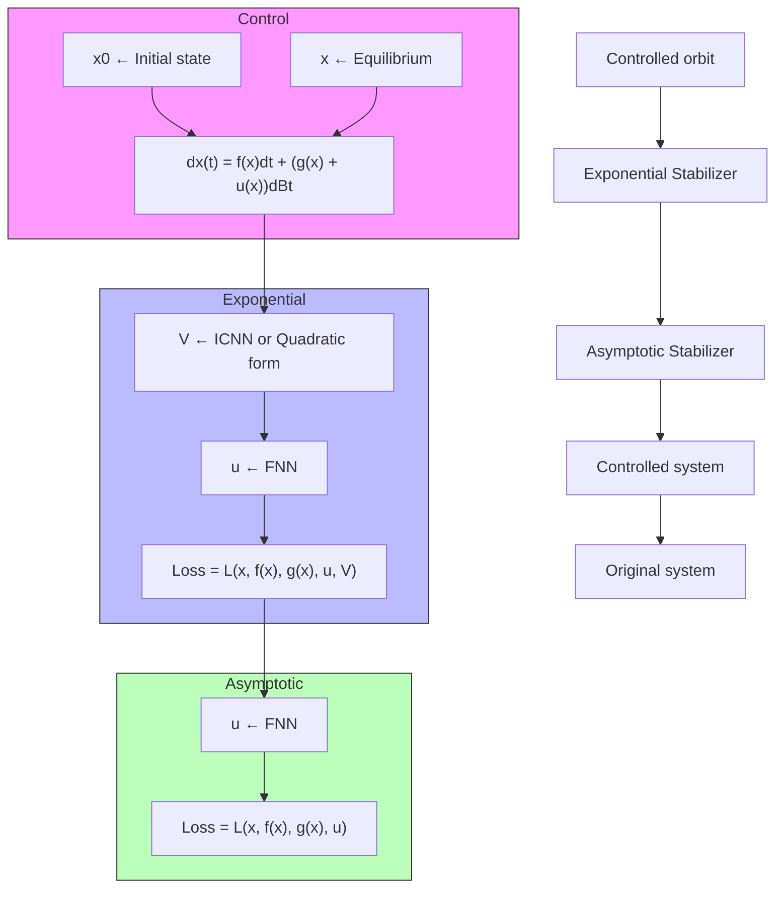

The stability theory for stochastic systems has been systematically developed in the past several decades. Representative contributions in the literature include the Lyapunov-like stability theory for SDEs Mao (2007), stabilization of unstable states in ODEs only using noise perturbations Mao (1994b), and the stability induced by randomly switching structures Guo et al. (2018). Generally, for any SDEs governed by $\mathrm { i } \pmb { x } = f ( \pmb { x } ) \mathrm { d } t + g ( \pmb { x } ) \mathrm { d } B _ { t }$ , control policies as $\pmb { u } = ( \pmb { u } _ { f } , \pmb { u } _ { g } )$ are introduced, which transforms the original equations into the controlled system $\mathrm { l } \pmb { x } = [ f ( \pmb { x } ) + \pmb { \imath } _ { f } ( \pmb { x } ) ] \mathrm { d } t + [ g ( \pmb { x } ) + \pmb { \imath } _ { g } ( \pmb { x } ) ] \mathrm { d } B _ { t }$ . Appropriate forms of control policies are able to steer the controlled system to the equilibriums that are unstable in the original SDEs. Traditional control methods focus on designing deterministic control $\pmb { u } _ { f }$ and regard noise as negative part. Innovatively, we treat noise as a beneficial part and design stochastic control $\pmb { u } _ { g }$ to achieve the stabilization.

flowchart

Figure 1: Sketches of the two frameworks of neural stochastic controller. Both the ES and AS find control function u with fully connected feedforward NN (FNN).
