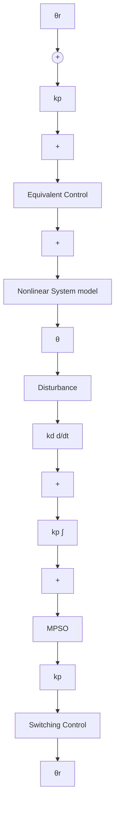

# V. STABILITY

Lyapunov stability criteria’s origin dates back to 1970’s by Leitmannn and Gutman [42, 66-68]. It is the most popular approach to evaluate and to prove the stable convergence property of the sliding mode controller. Second Lyapunov approach is used to prove the stability.

Candidate Lyapunov function for equivalent approach:

$$V (t) = \frac {1}{2} s ^ {2} (t) \text { with } V (0) = 0 \text { and } V (t) > 0 \text { for } s (t) \neq 0. \tag {30}$$

A sufficient condition or reaching condition is to select the control law that forces the trajectory of error to the sliding phase from reaching phase, given as

$$\dot {\mathcal {V}} (s) = - s ^ {T} \operatorname{diag} \left\{\operatorname{sign} \left(s _ {i}\right) \right\} | \dot {s} | = - \left| s ^ {T} \right| \left| \dot {s} \right| < 0 \tag {31}$$

Substituting (16) in (21), we get

$$\dot {\mathcal {V}} (t) = s (t) \left(- k _ {s c} \operatorname{sign} (s (t)) - d (t)\right) \tag {32}$$

which is derived to prove the Lyapunov criteria.

$$\dot {\mathcal {V}} (t) = - k _ {s c} | s (t) | - s (t) d (t) \tag {33}\dot {\mathcal {V}} (t) \leq - k _ {s c} | s (t) | + s (t) d _ {m a x} \tag {34}\dot {\mathcal {V}} (t) \leq - | s (t) | (k _ {s c} - d _ {m a x}) \tag {35}\dot {\mathcal {V}} (t) \leq 0. \tag {36}$$

In the reaching phase with $s ( t ) \neq 0$ , we get $k _ { s c } > d _ { m a x }$ and $| s ( t ) | > 0$ which lead to $\dot { \mathcal { V } } ( t ) \leq 0$ i.e. a negative definite condition, satisfying the direct Lyapunov stability criteria.

Candidate Lyapunov function for the proposed approach

$$V (t) = 1 / 2 s ^ {2} \Rightarrow \dot {V} (t) = s \dot {s} \tag {37}$$

Substituting from (26),

$$\dot {V} (t) = s \left| - k s - k _ {s c} \right| s \left| ^ {\alpha}. s a t (s) \right| \tag {38}\dot {V} (t) = - k s ^ {2} - k _ {s c} | s | ^ {\beta}. \tag {39}$$

So $\dot { V } ( t ) < 0$ because $> 0 , k _ { s c } > 0$ , verifying the condition that the PID sliding mode surface exist and can reach under the control law (23) for system (4).

flowchart

Figure 1. Description of the nonlinear system based on sliding mode control.
