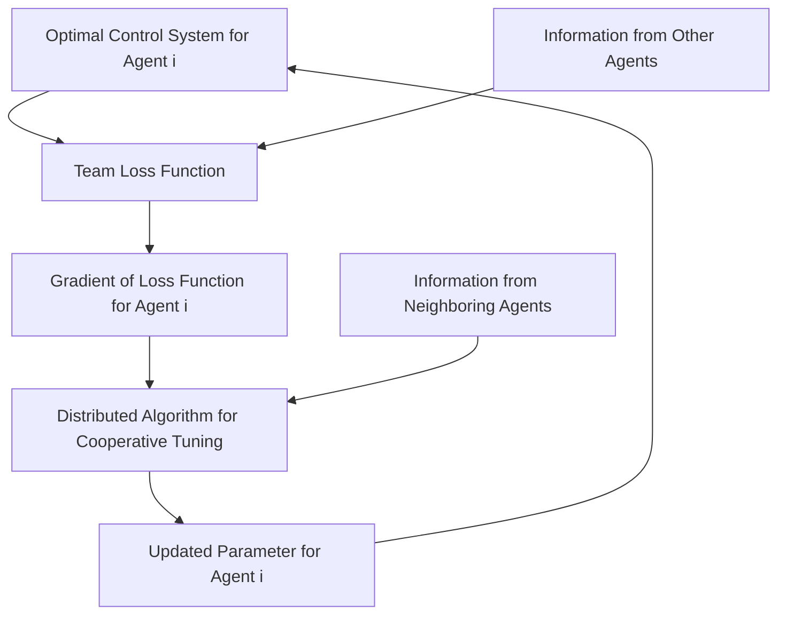

By working as a cohesive whole, a multi-agent system can usually accomplish complicated missions well beyond capabilities of individual subsystems [14], [15]. But there is little work on the problem of cooperative tuning of multiagent optimal control systems (CT-MAOCS). The scenario to be considered envisages individual agents in which a certain adjustable parameter appears in each, and such that optimal controls (based on an agent-specific performance index) for each agent can be computed using the individual parameter and performance index. Figure 1 illustrates the arrangement. CT-MAOCS can be applied to multi-agent consensus problems where the shared information is a tunable parameter in the OC system of each agent. Parameter tuning needs to achieve a consensus while the optimal trajectory of each agent needs to satisfy a specific task specification under this consensus. An example treated in a later section is the synchronous multi-agent rendezvous problem [16], in which agents should determine their own optimal trajectories such that the rendezvous takes place at a certain specified time. The challenge in solving the problem of CT-MAOCS comes from two parts: first, each individual loss function $L _ { i }$ is expressed using an explicit function both of the parameter $\theta _ { i }$ and the trajectory of the associated OC system, which makes the whole optimization problem at least a bi-level optimization; second, the optimization goal involves not just minimization of each agent’s individual loss $L _ { i }$ but the teamaverage loss, for which all tunable parameters need to be adjusted cooperatively. Main contribution of this paper is the development of a distributed framework to solve the problem of CT-MAOCS, which comes from a combination of a consensus-based distributed rule for multi-agent optimization in [17] and a gradient generator in [7].

flowchart

