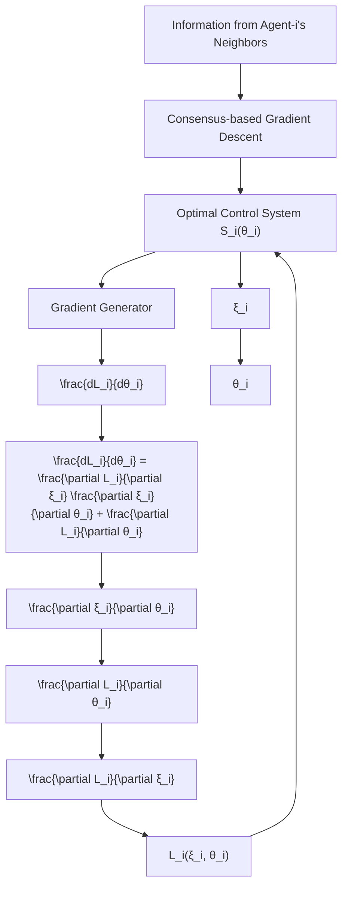

To sum up, we employ the following framework for cooperative tuning of Multi-Agent Optimal Control, i.e. to solve the problem in (2). This framework is based on a combination of the consensus-based gradient descent algorithm in (4) and the gradient generator in (9), as shown in Fig. 2.

By Lemma 2, Lemma 3 and Lemma 4, one has the following main result.

flowchart

Fig. 2: The framework for cooperative tuning

Theorem 6. Suppose that Assumption 1 holds. The $\mathit { d i s } \mathrm { - }$ tributed update (4) is utilized for (2), where $\frac { d L _ { i } ( \pmb { \xi } _ { i } , \pmb { \theta } _ { i } ) } { d \pmb { \theta } _ { i } }$ dLi(ξi,θi) d θ i is computed by the chain rule in (7) and $\frac { \partial \pmb { \xi } _ { i } ( \pmb { \theta } _ { i } ) } { \partial \pmb { \theta } _ { i } }$ is obtained by the gradient generator (9). One has all $\mathbf { \bar { \theta } } _ { i } ( k ) \to \mathbf { \theta } ^ { * }$ as $k  \infty f o r$ all $i \in \nu$ where $\pmb { \theta } ^ { * }$ solves the problem in (2).
