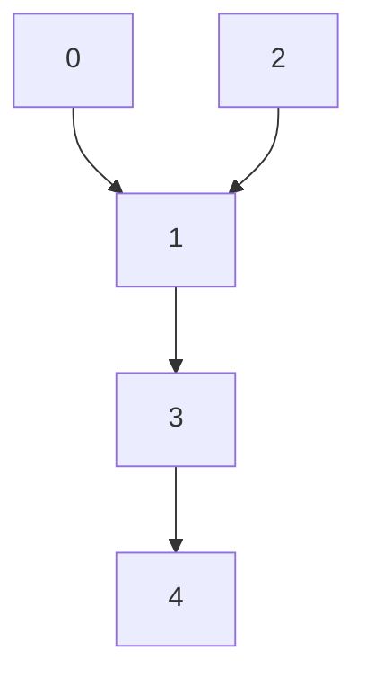

# IV. SIMULATION AND RESULTS

In this section, we illustrate the efficacy of the proposed Algorithm 1 in an example, in which the system consists of four followers and a leader as depicted in Fig. 1. The exosystem (#0) is a harmonic oscillator described by the matrix E and the followers $( \# 1 - 4 )$ are described by the matrices $A _ { i } , B _ { i } , C _ { i } , D _ { i }$ , and $F _ { i }$ .

flowchart

Fig. 1. The communication topology of the overall system.

In this example we assume that there is no prior knowledge of the dynamics of the system $( A _ { i } , B _ { i } ,$ and $D _ { i } { \bar { ) } } ,$ , or the exosystem dynamics (E). The system matrices for the system described in (1)-(3) are shown below for simulation purposes.

$$
A _ {i} = \left[ \begin{array}{c c c} 1 & 1 + i & 0 \\ 0 & 2 & - 0. 5 i \\ 1 & 0 & 1 + i \end{array} \right], B _ {i} = \left[ \begin{array}{c} 0 \\ 1 \\ i \end{array} \right], C _ {i} = \left[ \begin{array}{c c c} 1 / i & 0 & 0 \end{array} \right],

D _ {i} = \left[ \begin{array}{c c c c} 1 & 0 & - 1 & 0 \\ 0 & 0 & 1. 5 i & 0 \\ 0 & 1 & 0 & - 0. 5 i \end{array} \right], F _ {i} = \left[ \begin{array}{c c c c} - 0. 7 5 i & 0 & 1 & 0 \end{array} \right],
$$

$\mathrm { a n d ~ } E = \mathrm { b d i a g } \left( \left\lceil \begin{array} { c c } { { 0 } } & { { 1 } } \\ { { - 1 } } & { { 0 } } \end{array} \right\rceil , \left\lceil \begin{array} { c c } { { 0 } } & { { 0 . 7 5 } } \\ { { - 0 . 7 5 } } & { { 0 } } \end{array} \right\rceil \right) .$
