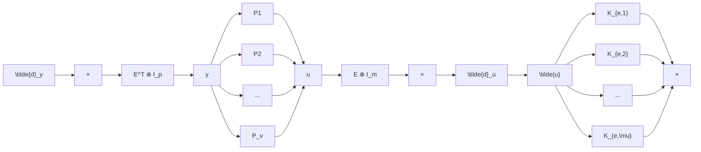

where coprimeness is understood as the existence of Bézout coefficients in $H _ { \infty }$ , see Appendix A. The representation of $P _ { i }$ above is known as its coprime factorization. We hereafter refer to the transfer functions $M _ { i } ( s )$ and $\tilde { M } _ { i } ( s )$ as the right and left denominators of $P _ { i }$ , respectively, and the transfer functions $N _ { i } ( s )$ and $\tilde { N } _ { i } ( s )$ as its right and left numerator. Assumption $\mathcal { A } _ { 1 }$ is practically nonrestrictive. It holds for all finite-dimensional agents with proper transfer functions and is equivalent to the stabilizability of $P _ { i }$ by feedback for agents with transfer functions from the quotient field of $H _ { \infty }$ (Smith, 1989). Thus, if an agent fails to satisfy $\mathcal { A } _ { 1 }$ , we cannot expect any MAS that includes it to be stabilizable by diffusive coupling.

Remark 1. We choose the application points of exogenous disturbances for the internal stability analysis to be at the points where the agents, $P ,$ are connected with the controller 𝐾 defined in (4). In this choice we follow the physical nature of the interconnection in Fig. 2 and think of separating the blocks 𝐸 ⊗ 𝐼 and $E ^ { \top } \otimes I$ in the controller as merely a way to streamline the choice of the design parameters, which are the edge controllers in $K _ { \mathrm { e } }$ . An alternative viewpoint is presented in Fig. 3, where all fixed parts are regarded as the controlled plant,

flowchart

Figure 3: Diffusively-coupled feedback setup as edge stabilization

$$P _ {\mathrm{e}} := (E ^ {\top} \otimes I _ {p}) P (E \otimes I _ {m}), \tag {6}$$

much inline with the generalized plant philosophy (Skogestad and Postlethwaite, 2005, Sec. 3.8), see e.g. (Zelazo and Mesbahi, 2011a, Fig. 6) or (Bullo, 2022, E9.6). A natural definition of internal stability for it shall be based on the exogenous inputs $\tilde { d } _ { y }$ and ${ \tilde { d } } _ { u } ,$ entering before and after the edge controller $K _ { \mathrm { e } }$ . This would change the results, see Remark 3 at the end of §4.1. Still, we believe that the configuration in Fig. 2 is the right way to address the internal stability of MASs. After all, it is the agents who interact with the environment.
