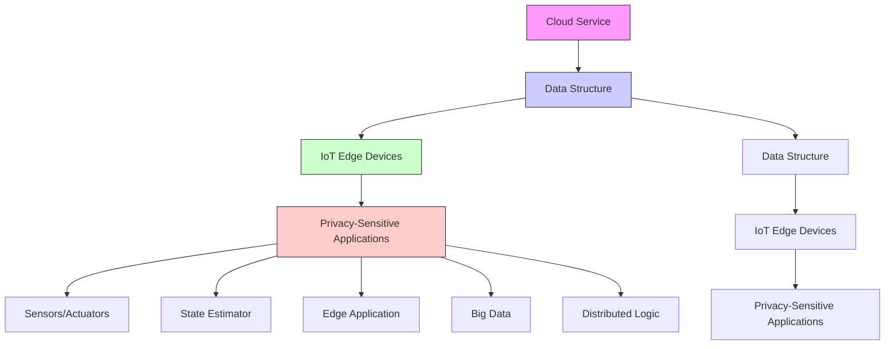
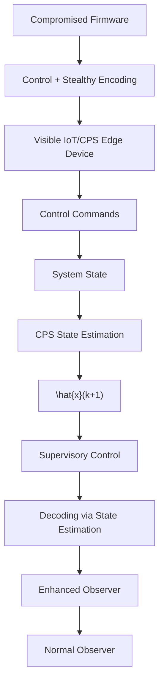

# C. A Control Systems Summarization

We formalize a control-theoretic, systems-oriented model of our proposed attacker and defender models. This systemsview summarizes the aforementioned attack vectors and elaborates on how an attacker/defender would begin to model the physical variables and their cyber-physical dependencies. To start, we can choose to describe the cyber-physical system as a set of discrete-time, non-linear stochastic equations representing the dynamics of the system as:

$$x (t + 1) = f (x (t), u (t)) + g (w (t)) \tag {1}$$

flowchart

Figure 1: Edge computation system model.

flowchart

Figure 2: Data exfiltration attack overview.

With $\ b { x } ( t ) \in \mathbb { R } ^ { n }$ as the state vector, $u ( t ) \in R ^ { p }$ as the control input, $\bar { f } ( \boldsymbol { x } ( t ) , \boldsymbol { u } ( t ) )$ ) as a deterministic propagation function and $g ( w ( t ) )$ being a potentially non-linear function of the system’s process noise $w ( t ) \in \dot { R ^ { r } }$ , described by an underlying probability density function [29].

The CPS can also access information from its available set of sensing instruments. We can model a set of sensors using a stochastic transformation over the system state vector as:

$$z (t) = h (x (t)) + v (t) \tag {2}$$
