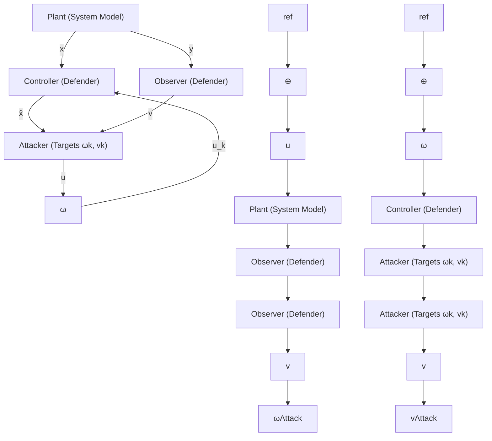

Attacker systems model. An attacker is formalized to take the plant’s estimator output xˆ and the controller’s output $u _ { k }$ as inputs to its system. In contrast, the defender attempts to monitor (and identify) deviations to the expected control inputs and state. To deviate a system’s response, an attacker will add an attack vector to the process noise, $\omega _ { k }$ to the actuators and/or sensor noise, $v _ { k }$ to the measurement, respectively. In doing so, the attacker can break multiple independence assumptions the system state estimator may rely upon for its estimation model. Therefore, the system state, i.e., xk can now be correlated to the process or measurement noise by the attacker’s choosing. The choice and encoding scheme of the attacker will be domain specific and described in the subsequent section. But first, we briefly discuss the defender model in this context.

flowchart

Figure 3: Control system representation of the threat model. Add chi-squared detector to this model

Defender systems model. The defender differs from the system’s state estimator, in that the defender uses the output of the state estimate and its policy to detect whether a state deviates from its intended path. The goal of the defender will be to distinguish whether a perturbation is due to an attack or merely a random perturbation. This formalization allows us to model the encoding and decoding of data into covert channels, and subject them to systems-theory, when necessary. We now use our control-theoretic representation of attacker and defender in the context of covert data exfiltration. We define what an attacker’s stealthiness and imperceptibility is with respect to this systems model.
