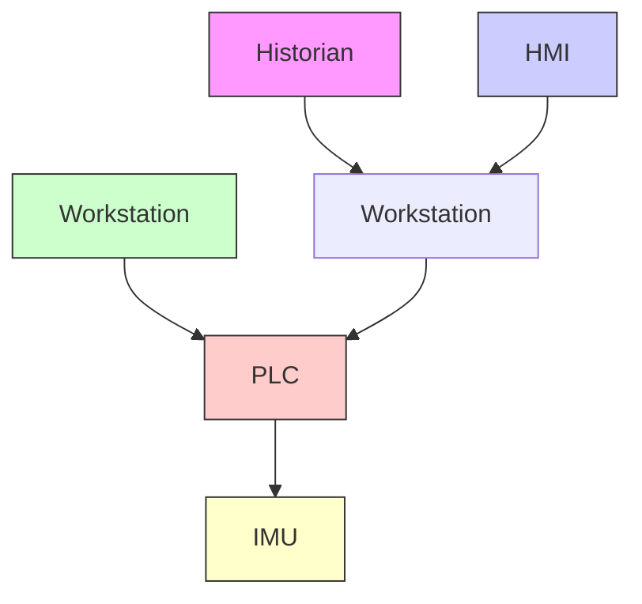

In practice, it is difficult to develop a perfectly robust state estimation model for real-world applications as the state dynamics and measurements can be far from ideal. Further, a defender can only develop a state estimation model for the observable set of physical variables–including the physical channels and associated noise models that depend on a particular variable. This means that the state estimation model is heavily dependent on not only the availability and quality of sensors instrumentation, but also the associated level of process noise for the system model. For instance, if the robotic arm is making inferences about it’s own pose and reporting just the XY-coordinates of the robots end effector before and after a movement command, then a state estimator is only able to report the posterior $\hat { x } _ { t }$ then prior $\bar { x } _ { t + 1 }$ state estimates and associated covariances of the end effector. An anomaly could be detected using a distance metric such as a Euclidean distance to see if the current XY-coordinates, $\{ ( x _ { 1 } , y _ { 1 } ) , ( x _ { 2 } , y _ { 2 } ) \}$ are close enough to the xˆ and yˆ estimates within a certain error , i.e.,


<details>
<summary>flowchart</summary>


</details>


<details>
<summary>flowchart</summary>

```mermaid
graph TD
    subgraph "Estimation-Free Trajectory"
        A["Start"] --> B["0"]
        B --> C["0"]
        C --> D["1"]
        D --> E["0"]
        E --> F["1"]
        F --> G["0"]
        G --> H["1"]
        H --> I["1"]
        I --> J["1"]
        J --> K["&quot;End"]
        end
    end

subgraph "With Trajectory Estimation"
        L["Start"] --> M["0"]
        M --> N["0"]
        N --> O["1"]
        O --> P["0"]
        P --> Q["1"]
        Q --> R["0"]
        R --> S["1"]
        S --> T["1"]
        T --> U["&quot;End"]
        end
    end
