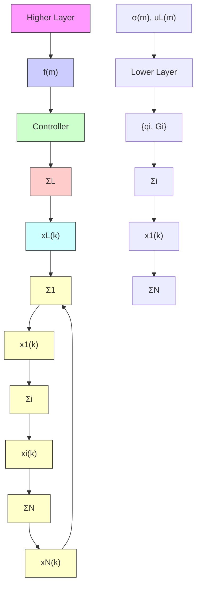

# 2.2 TH-MAS: System description

Consider a time-varying hierarchical mutli-agent system (see Figure 1) where, in the higher layer, a discrete-time controller calculates the number of active followers, as $\sigma ( m ) \in  { \mathbb { N } } _ { + }$ , and the states of the leader $\left( \Sigma _ { L } \right)$ determined by its control input $( u _ { L } ( m ) \in \mathbb { R } )$ , i.e.

$$f (m): \mathbb {R} ^ {n _ {f}} \rightarrow (\mathbb {N} _ {+}, \mathbb {R}), \tag {3}$$

flowchart

Fig. 1. TH-MAS illustration.

where $n _ { f } \in  { \mathbb { N } } _ { + }$ is the controller input dimension.

The lower layer consists of N follower agents which are labeled by $1 , 2 , \ldots , N$ and a leader labeled by N + 1. The follower agent dynamics are defined as

$$\Sigma_ {i}: x _ {i} (k + 1) = x _ {i} (k) + w q _ {i} (k) u _ {i} (k), \tag {4}$$

where $w \in \mathbb { R } , x _ { i }$ and $u _ { i } ~ \in ~ \mathbb { R }$ are the $i ^ { t h }$ follower state and control input, respectively and $q _ { i } \in \{ 0 , 1 \}$ is a selection variable determining which agents are controlled at each time instant k.

The leader states depend on the control input $( u _ { L } ( m ) )$ from the higher layer controller, such that

$$x _ {L} (k + 1) = (1 - q _ {L} (k)) x _ {L} (k) + q _ {L} (k) u _ {L} (k), \tag {5}$$

where $m \in \mathbb { N }$ and $k \in \mathbb N$ are the discrete-time indices of the higher and lower layer, and

$$
q _ {L} (k) = \left\{ \begin{array}{l l} 1 & \text { if   } k = m M, \\ 0 & \text { if   } k \in [ (m - 1) M + 1, m M), \end{array} \right. \tag {6}
$$
