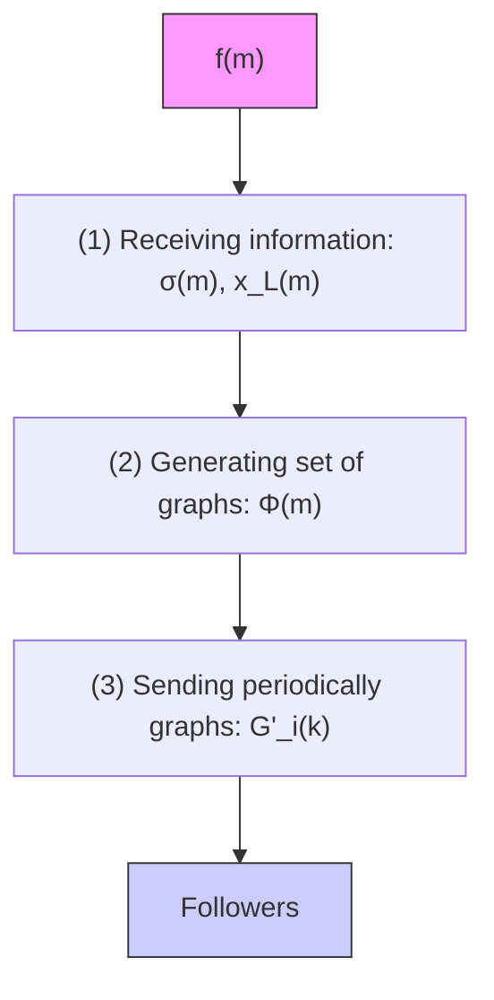

# 3.1 Consensus of TH-MAS: Higher Layer

Equation (7) constraints the number of controlled followers, yet we still have the freedom to select at each sampling time $( k T _ { s } )$ which followers are active (controlled). Motivated by this degree of freedom, we design a switching algorithm to determine which followers are controlled while (7) and (8) are met. This algorithm is implemented in the leader agent, which as described in Figure 3 has three main tasks: receive information from the higher layer, generate a set of graphs and periodically send the active graph to the followers.

flowchart

Fig. 3. Flowchart depicting the proposed switching algorithm implemented in the leader of the considered TH-MAS

Under requirements from (7) and (8), we design a switching graph algorithm that periodically loops within a finite set of sorted communication graphs, i.e.

$$\Phi (m) = \{\mathcal {G} _ {0} ^ {\prime} (k), \dots , \mathcal {G} _ {p (m) - 1} ^ {\prime} (k) \}, \tag {13}$$

with

$$\mathcal {G} _ {i} ^ {\prime} (k) \neq \mathcal {G} _ {j} ^ {\prime} (k). \tag {14}$$

Note that the condition (14) is true since

$$\mathcal {V} _ {i} ^ {\prime} (k) \neq \mathcal {V} _ {j} ^ {\prime} (k) \text { and } | \mathcal {V} _ {i} ^ {\prime} (k) | = | \mathcal {V} _ {j} ^ {\prime} (k) | \tag {15}$$

for all $i , j \in \{ 0 , \ldots , p ( m ) - 1 \}$ , where

$$p (m) = \frac {(N) !}{(N - \sigma (m)) ! \sigma (m) !} \in \mathbb {N} _ {+}. \tag {16}$$

Notice that (16) shows how the number of combinations of selecting a specific number of followers from the entire system determines the cardinality of the set Φ(m). Equations (16) and (15) ensure the uniqueness of all the graphs within Φ(m). As depicted in Figure 4, the edges of nodes $( \mathcal { E } _ { i } ^ { ' } ( k ) )$ ) are linked such that the communication network topology is always the same. In this case, all $\mathcal { E } _ { i } ^ { ' } ( k )$ have a ring topology.

flowchart

