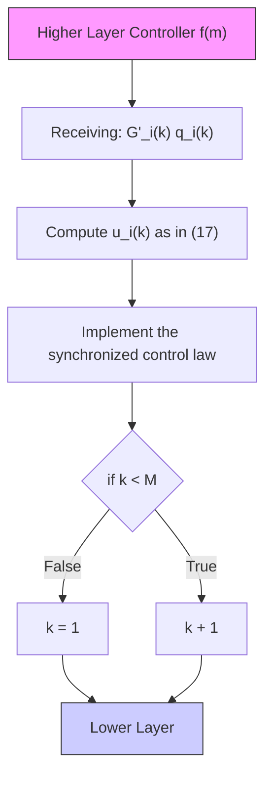

where $\bar { \pmb { \mathscr { G } } } = ( \bar { \pmb { \mathscr { V } } } , \bar { \pmb { \mathscr { E } } } )$ . Since the sorted set of graphs Φ contains all the possible combinations of choosing certain number of nodes from V¯, then $\bar { \nu } ^ { \prime } = \bar { \nu }$ . Moreover, $\bar { \varepsilon }$ describes a communication network where the followers are fully connected because $\bar { \mathcal { V } } ^ { \prime } =$ V¯ and $\mathcal { G } _ { i } ^ { ' } ( k )$ have a spanning three. Hence, $\bar { \pmb { g } }$ is a graph with a spanning tree that covers all the agents within G.

The proof of (Ren and Beard, 2005) does not include the case when the set of active agents varies with time. Yet, the notions explained in (Ren and Beard, 2005) are used to implement a solution for the considered TH-MAS. In this case, the control law as in (19) subject to the changing graphs from the switching algorithm is applied to all the active followers, see Figure 5. Note that for proving the asymptotic convergence of the proposed solution the following assumption is made.

Assumption 5. Consider that $x _ { L } ( k )$ does not change, i.e.

$$q _ {L} (k) = 0, \forall k \in \mathbb {N} _ {+}$$

and $x _ { L } ( 0 ) = \bar { x }$

flowchart

Fig. 5. Flowchart depicting the proposed control algorithm implemented in the followers considered TH-MAS

Theorem 6. Consider the TH-MAS as in $( 4 ) – ( 5 )$ with the constraints (7), a switching graph $\mathcal { G } ( k )$ as in (17), and a control input $\left( u _ { i } ( k ) \right)$ as in (19), such that

$$0 < k _ {f b} < \frac {1}{\max (d _ {i}) w}, \tag {25}$$

where $d _ { i } \in \mathbb { N }$ are the elements in the diagonal of the degree matrix (D). Suppose that Assumption 5 holds. Then, all the followers reach a consensus state, i.e.

$$\lim _ {k \to \infty} \boldsymbol {x} (k) = \bar {x} \mathbf {1} _ {N + 1} \tag {26}$$

where $\bar { x } = x _ { L } ( 0 )$ is the consensus state.
