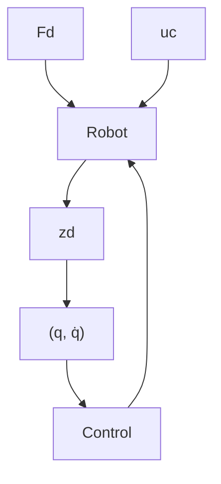

# III. IMPEDANCE CONTROL

A systematic framework for the selection of the control parameters k and b requires to main factors: (i) a way to measure the performance of the robot and (ii) a numerical algorithm to optimize such performance. For the first objective, we will extend the robot equations with auxiliary input/output variables as follows:

$$M (q) \ddot {q} + C (q, \dot {q}) \dot {q} + g (q) = u _ {c} + J _ {d} (q) ^ {T} F _ {d} \tag {4}z _ {d} = h _ {d} (q).$$

The control pair $( u _ { c } , ( q , \dot { q } ) )$ will be used to design a controller of the form (2), (3). This corresponds to selecting k and b once the structure of the controller has been decided (i.e. the placement of springs and dampers). The performance pair $( F _ { d } , z _ { d } )$ captures the effect that a perturbing exogenous force $F _ { d }$ has on the displacement $z _ { d }$ . High performance position control, for example, would require insensitivity of the displacement $z _ { d }$ to the perturbing force $F _ { d }$ . This corresponds to enforcing a low gain between $F _ { d }$ and $z _ { d } .$ In contrast, a compliant robot would allow for large displacements $z _ { d }$ for small perturbations $F _ { d }$ . In this setting, the selection of the parameters k and b can be guided by optimization. For a controller of the form (2), (3), the goal is to find the best selection of k and b that optimize some performance metric on $( F _ { d } , z _ { d } )$ .

flowchart

Fig. 2. Feedback control loop to optimize performances on $( F _ { d } , z _ { d } )$ .

The control task is illustrated in Figure 2. We close the loop on the control pair $( u _ { c } , ( q , \dot { q } ) )$ with a controller of the form (2), (3) with the goal of shaping the behaviour captured by the performance pair $( F _ { d } , z _ { d } )$ . This setting finds contacts with impedance control [10] and classical robust control synthesis [24]. Indeed, impedance control recognizes that positions and forces cannot be controlled independently and the best we can do is to shape the relationship between these quantities. Likewise, in the linear setting, robust control provides methods to find a controller that minimize the gain between $F _ { d }$ and $z _ { d }$ .
