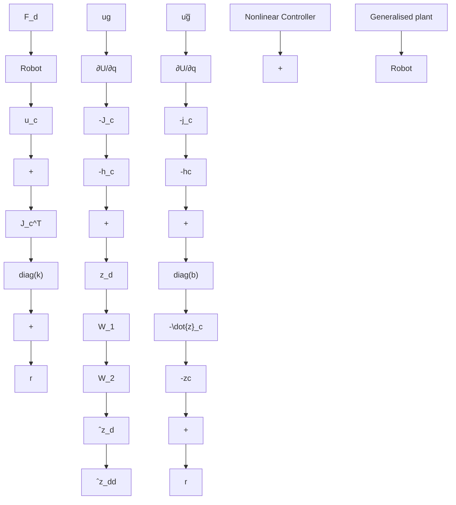

In what follows we will assume that $z _ { c } = h _ { c } ( q )$ in (2), (3) is given. That is, we start from a predefined placement of virtual springs and dampers attached to various points of the robots. This corresponds to the particular shaping of the desired energy given by (1). We assume that $h _ { c }$ is a differentiable invertible function within the region of interest. This will allow us to derive an equivalent representation of the robot in the coordinates $z _ { c } ,$ which suits linearization methods for state-feedback design. We will look into controllers of the form (2), (3) and we will design the control parameters k and b to shape the relationship between $F _ { d }$ and $z _ { d }$ , following the approach of impedance control.

The actual synthesis of the control parameters will be performed via $\mathcal { H } _ { \infty }$ synthesis [24]. Specifically, we will use linear matrix inequalities [4] to derive a state-feedback controller that optimizes locally the performances captured by $( F _ { d } , z _ { d } )$ , measured via $\mathcal { H } _ { \infty }$ metric. We will allow for the optimization of weighted performances represented by

$$\hat {z} _ {d} = W _ {1} z _ {d} \quad \hat {z} _ {d d} = W _ {2} \dot {z} _ {d} \tag {5}$$

The role of $W _ { 1 }$ and $W _ { 2 }$ is to scale non-uniformly the components of $z _ { d }$ and of its derivative. For simplicity of the exposition they are constant, real matrices. However, the design can be easily extended to frequency dependant weights. We will show how our conditions based on linear matrix inequalities lead to control parameters k and b that preserve the passivity of the robot. The overall structure of the controller is summarized in Figure 3.

flowchart

Fig. 3. The overall structure of the controller connects the energy shaping and damping injection approach with impedance control $\varkappa _ { \infty }$ synthesis of the controller parameters k and b.
