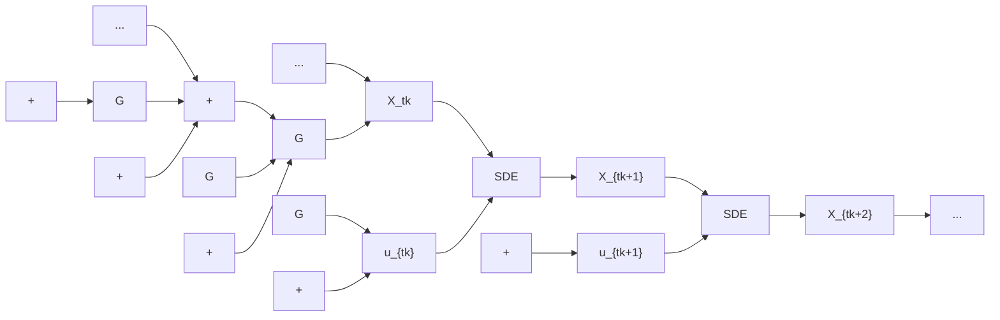

# Algorithm 3 Adadelta update

Parameters: $\overline { { \beta _ { 1 } , \beta _ { 2 } , \lambda > 0 } }$

$$\mathrm{MS} _ {n + 1} = \beta_ {1} \mathrm{MS} _ {n} + (1 - \beta_ {1}) g _ {n + 1} \odot g _ {n + 1}P _ {n + 1} = \operatorname{diag} \left(\left(\lambda \mathbb {1} + \widehat {\mathrm{MS}} _ {n}\right) \oslash \left(\lambda \mathbb {1} + \sqrt {\widehat {\mathrm{MS}} _ {n}}\right)\right)\theta_ {n + 1} = \theta_ {n} - \gamma_ {n + 1} P _ {n + 1} \cdot g _ {n + 1}.\widehat {\mathrm{MS}} _ {n + 1} = \beta_ {2} \mathrm{MS} _ {n} + (1 - \beta_ {2}) (\theta_ {n + 1} - \theta_ {n}) \odot (\theta_ {n + 1} - \theta_ {n}).$$

The Layer Langevin algorithm, introduced in [Bra22] consists in updating with Langevin noise only some layers of the network. It relies on the heuristic that for a deep neural network, the non-linearities of the network are mostly contained in the deepest layers and adds Langevin noise to these layers only.

Choosing a preconditioner rule P called name, the Layer Langevin algorithm denoted LL-name reads

$$\theta_ {n + 1} ^ {(i)} = \theta_ {n} ^ {(i)} - \gamma_ {n + 1} [ P _ {n + 1} \cdot g _ {n + 1} ] ^ {(i)} + \mathbb {1} _ {i \in \mathcal {J}} \sigma_ {n + 1} \sqrt {\gamma_ {n + 1}} \big [ \mathcal {N} (0, P _ {n + 1}) \big ] ^ {(i)}, \tag {2.11}$$

where J is a subset of weight indices. In particular, we denote LL-name p% the Layer Langevin name algorithm where the Langevin layers are chosen to be the first p% layers.


<details>
<summary>flowchart</summary>

```mermaid
graph TD
    u["u"] --> X_tk["X_{t_k}"]
    X_tk --> SDE["SDE"]
    SDE --> X_{t_{k+1}}[X_{t_{k+1}}]
    X_{t_{k+1}} --> SDE2["SDE"]
    SDE2 --> X_{t_{k+2}}[X_{t_{k+2}}]
    X_{t_{k+2}} --> ...[...]
    ... --> G1["G"]
    G1 --> +1["+"]
    +1 --> X_tk
    X_{t_{k+1}} --> G2["G"]
    G2 --> +2["+"]
    +2 --> X_{t_{k+2}}
    X_{t_{k+2}} --> G3["G"]
    G3 --> +3["+"]
    +3 --> ...[...]
```
</details>

Figure 1: Depth of Markovian neural networks. The control u acts on $X _ { t _ { k } }$ , which itself acts on $X _ { t _ { k + 1 } } , X _ { t _ { k + 2 } } ,$ $\ \dots , X _ { t _ { N } }$ , hence the depth of the network.   


<details>
<summary>flowchart</summary>


</details>

Figure 2: Markovian neural network with one control for every time step.
