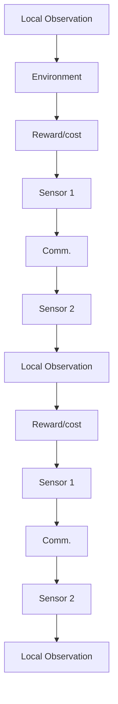

# I. INTRODUCTION

As 5G is rolling out, a wave of new applications such as the internet of things (IoT), industrial internet of things (IIoT) and autonomous vehicles is emerging. It is projected that by 2030, approximately 30 billion IoT devices will be connected [1]. With the proliferation of non-human types of connected devices, the focus of the communications design is shifting from traditional performance metrics, e.g., bit error rate and latency of communications to the semantic and task-oriented performance metrics such as meaning/semantic error rate [2], [3] and the timeliness of information [4]. To evaluate how efficiently the network resources are being utilized, one could traditionally measure the sum rate of a network whereas in the era of the cyber-physical systems, given the resource constraints of the network, we want to understand how effectively one can conduct a (number of) task(s) in the desired way [5], [6]. We are witnessing a paradigm shift in communication systems where the targeted performance metrics of the traditional systems are no longer valid. This imposes new grand challenges in designing the communications towards the eventual task-effectiveness [6].

The authors are with the Centre for Security Reliability and Trust, University of Luxembourg, Luxembourg. Emails: {arsham.mostaani, thang.vu, symeon.chatzinotas, bjorn.ottersten}@uni.lu

This work is supported by European Research Council (ERC) via the project AGNOSTIC (Grant agreement ID: 742648).

a   

flowchart

b)   

flowchart

