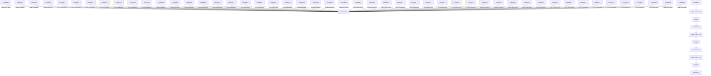

```mermaid
graph TD
    A["Controller 2"] -->|Local Observation| B["Environment"]
    C["Controller 2"] -->|Local Observation| B
    D["Controller 2"] -->|Local Observation| B
    E["Controller 2"] -->|Local Observation| B
    F["Controller 2"] -->|Local Observation| B
    G["Controller 2"] -->|Local Observation| B
    H["Controller 2"] -->|Local Observation| B
    I["Controller 2"] -->|Local Observation| B
    J["Controller 2"] -->|Local Observation| B
    K["Controller 2"] -->|Local Observation| B
    L["Controller 2"] -->|Local Observation| B
    M["Controller 2"] -->|Local Observation| B
    N["Controller 2"] -->|Local Observation| B
    O["Controller 2"] -->|Local Observation| B
    P["Controller 2"] -->|Local Observation| B
    Q["Controller 2"] -->|Local Observation| B
    R["Controller 2"] -->|Local Observation| B
    S["Controller 2"] -->|Local Observation| B
    T["Controller 2"] -->|Local Observation| B
    U["Controller 2"] -->|Local Observation| B
    V["Controller 2"] -->|Local Observation| B
    W["Controller 2"] -->|Local Observation| B
    X["Controller 2"] -->|Local Observation| B
    Y["Controller 2"] -->|Local Observation| B
    Z["Controller 2"] -->|Local Observation| B
    AA["Controller 2"] -->|Local Observation| B
    AB["Controller 2"] -->|Local Observation| B
    AC["Controller 2"] -->|Local Observation| B
    AD["Controller 2"] -->|Local Observation| B
    AE["Controller 2"] -->|Local Observation| B
    AF["Controller 2"] -->|Local Observation| B
    AG["Controller 2"] -->|Local Observation| B
    AH["Controller 2"] -->|Local Observation| B
    AI["Controller 2"] -->|Local Observation| B
    AJ["Controller 2"] -->|Local Observation| B
    AK["Controller 2"] -->|Local Observation| B
    AL["Controller 2"] -->|Local Observation| B
    AM["Controller 2"] -->|Local Observation| B
    AN["Controller 2"] -->|Local Observation| B
    AO["Controller 2"] -->|Local Observation| B
    AP["Controller 2"] -->|Local Observation| B
    AQ["Controller 2"] -->|Local Observation| B
    AR["Controller 2"] -->|Local Observation| B
    AS["Controller 2"] -->|Local Observation| B
    AT["Controller 2"] -->|Local Observation| B
    AU["Controller 2"] -->|Local Observation| B
    AV["Controller 2"] -->|Local Observation| B
    AW["Controller 2"] -->|Local Observation| B
    AX["Controller 2"] -->|Local Observation| B
    AY["Controller 2"] --> AZ["Stage reward/ cost"]
    AZ --> BA["Control"]
    BA --> BB["Environment"]
    BB --> BC["Stage reward/ cost"]
    BC --> BD["Control"]
    BD --> BE["Environment"]
    BE --> BF["Stage reward/ cost"]
    BF --> BG["Control"]
    BG --> BH["Environment"]
```

