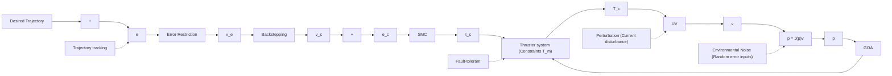

Fig. 3. Schematic of the proposed fault-tolerant trajectory tracking control designed for the UV.

$$
\mathbf {v} _ {\mathbf {c}} = \left[ \begin{array}{l} u _ {c} \\ v _ {c} \\ w _ {c} \\ r _ {c} \end{array} \right] \tag {11}

= \left[ \begin{array}{c} k (v _ {e x} \cos \psi + v _ {e y} \sin \psi) + u _ {d} \cos v _ {e \psi} - v _ {d} \sin v _ {e \psi} \\ k (- v _ {e x} \sin \psi + v _ {e y} \cos \psi) + u _ {d} \sin v _ {e \psi} - v _ {d} \cos v _ {e \psi} \\ w _ {d} + k _ {z} v _ {e z} \\ r _ {d} + k _ {\psi} v _ {e \psi} \end{array} \right].
$$

where $k , k _ { z }$ and $k _ { \psi }$ are positive constants.

Then the processed control velocities $\mathbf { v _ { c } }$ are passed to the UV, where they are calculated to keep pace with the desired trajectory through the dynamic model of the UV. Additionally, the stability of the refined backstepping control can be proved by constructing a Lyapunov function $\begin{array} { r } { \Gamma _ { 0 } = \frac { 1 } { 2 } ( e _ { x } ^ { 2 } + e _ { y } ^ { 2 } + e _ { z } ^ { 2 } + e _ { \psi } ^ { 2 } ) } \end{array}$ , whose derivative is less than and equal to zero (see Appendix A).

2) Sliding Mode Control: To design the sliding mode control, the desired dynamics (s) should be introduced. Based on Eq. (2) where the UV dynamic system is of the second order for the velocity v, the dynamics can be designed as

$$\mathbf {s} = \left[ \frac {d}{d t} + \lambda \right] ^ {2} \int \mathbf {e _ {v}} d t = \dot {\mathbf {e _ {v}}} + 2 \lambda \mathbf {e _ {v}} + \lambda^ {2} \int \mathbf {e _ {v}} d t, \tag {12}$$

where $\frac { d } { d t }$ is the derivative operator; $\mathbf { e _ { v } }$ represents the errors given by the control velocities (see Fig. 3), $\mathbf { e _ { v } } = \mathbf { v _ { c } } - \mathbf { v } ;$ and $\lambda > 0$ is a positive parameter [43].

Then take the derivative of s, we can get

$$\dot {\mathbf {s}} = \ddot {\mathbf {e}} _ {\mathbf {v}} + 2 \lambda \dot {\mathbf {e}} _ {\mathbf {v}} + \lambda^ {2} \mathbf {e} _ {\mathbf {v}}, \tag {13}$$
