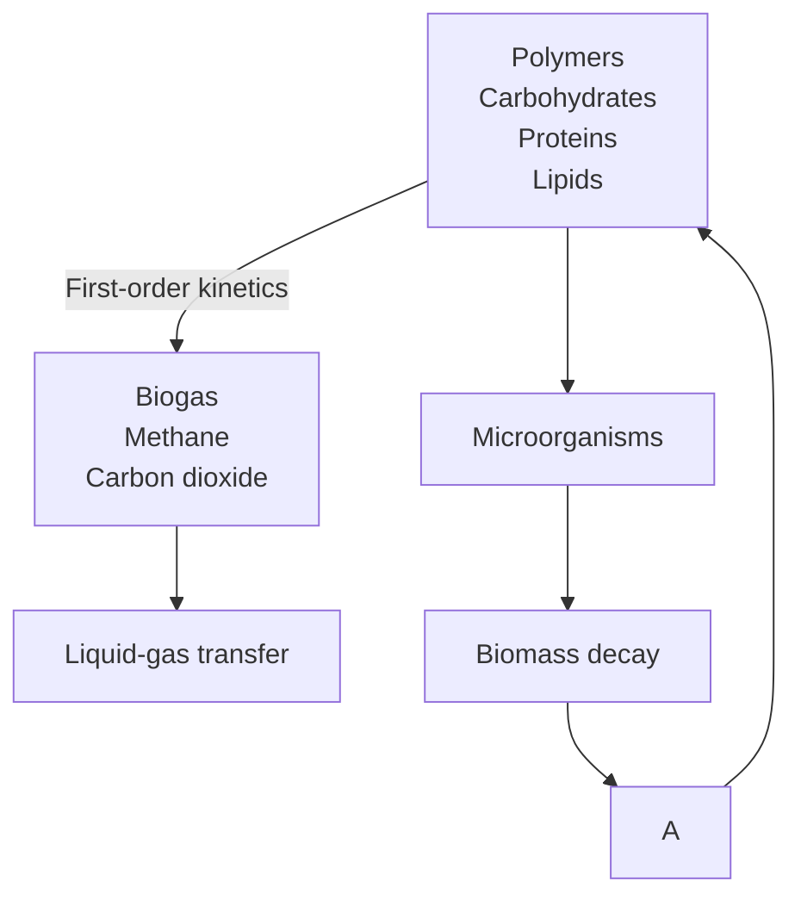

# 2.1.1 Model Simplification

Both ADM1-R4 and ADM1-R3 were further simplified throughout the investigation. For this purpose, individual model components were isolated and omitted or incorporated systematically to assess their influence on observability. Fig. 2 illustrates the full ADM1-R4 and its model parts qualitatively. These model parts are decay of microbial biomass and its stoichiometric feedback as macro nutrients (part A, in green), and gas solubility of methane and carbon dioxide (part B, in orange).

The ADM1-R3 allows to isolate more model parts as shown in Fig. 3. Part A and B were left identical as for the ADM1-R4 (in green and orange, respectively). Part C (in purple) describes inhibition through nitrogen limitation. Part D (in blue) covers inhibition through pH and ammonia, as well as dissociation of ammonium/ammonia. Lastly, part E (in red) contains the computation of pH, which includes the charge balance of available anions and cations.

flowchart

Figure 2: Model components of the ADM1-R4.

The core elements of the models ADM1-R4 and ADM1-R3 without any additional model parts are denoted as BMR4 and BMR3 (base model, BM). Augmenting them with additional model parts results in $\mathrm { e . g . }$ . BMR4+A. The same notation applies for individual ADM1-R3 model variations. The investigated models are summarized in Tab. 2. A full set of the corresponding model equations is given in the appendix.
