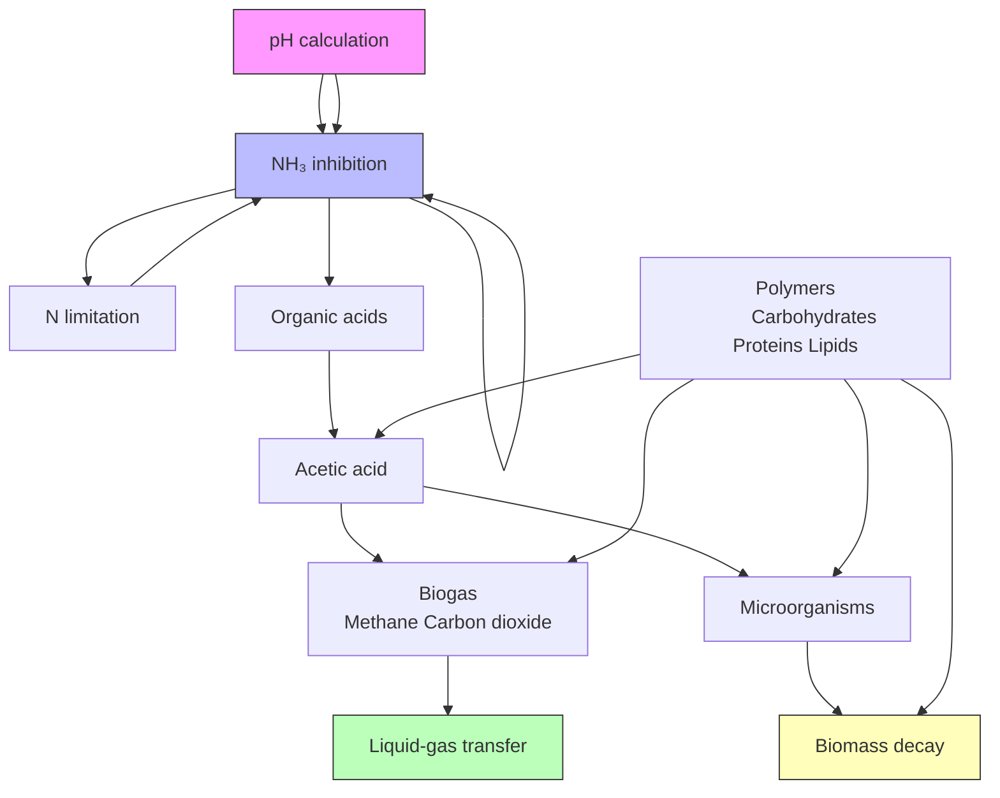

# 2.2 Observability Analyses

Definition. A state variable $x _ { i } ( t )$ is observable if its initial state $x _ { i } ( 0 )$ can be reconstructed from measurements of inputs $u ( \tau )$ and outputs $y ( \tau )$ over a finite time $\tau \in [ 0 , t ]$ . A system M is fully observable if all of its n states are observable. If at least one state is not observable, the system is not fully observable $[ 2 4 ]$ .

flowchart

Figure 3: Model components of the ADM1-R3.

In this work, two pathways to assess observability were pursued: the algebraic and the geometric approach. In the former, a system of equations of output variables and their time derivatives is established and solved for individual model states. The latter assesses the observability rank condition, which relies on an observability matrix.
