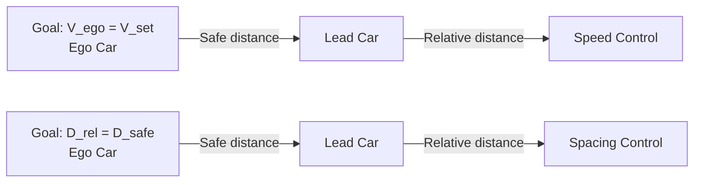

# V. EVALUATION ON ADAPTIVE CRUISE CONTROL SYSTEMS

In this section, our approach will be evaluated by the safety verification of an Adaptive Cruise Control (ACC) system equipped with a neural network controller as depicted in Fig. 1. The system dynamics is in the form of

$$
\left\{ \begin{array}{l} \dot {x} _ {l} (t) = v _ {l} (t) \\ \dot {v} _ {l} (t) = \gamma_ {l} (t) \\ \dot {\gamma} _ {l} (t) = - 2 \gamma_ {l} (t) + 2 \alpha_ {l} (t) - \mu v _ {l} ^ {2} (t) \\ \dot {x} _ {e} (t) = v _ {e} (t) \\ \dot {v} _ {e} (t) = \gamma_ {e} (t) \\ \dot {\gamma} _ {e} (t) = - 2 \gamma_ {e} (t) + 2 \alpha_ {e} (t) - \mu v _ {e} ^ {2} (t) \end{array} \right. \tag {30}
$$

where $x _ { l } ( x _ { e } ) , v _ { l } ( v _ { e } )$ and $\gamma _ { l } ( \gamma _ { e } )$ are the position, velocity and actual acceleration of the lead (ego) car, respectively. $\alpha _ { l } ( \alpha _ { e } )$ is the acceleration control input applied to the lead (ego) car, and $\mu = 0 . 0 0 1$ is the friction parameter. The ACC controller we considered here is a $5 \times 2 0$ feed-forward neural network with ReLU as its activation functions. The sampling scheme is considered as a periodic sampling every 0.01 seconds, i.e., $t _ { k + 1 } - t _ { k } = 0 . 0 1$ seconds.

The sampled-data neural network controller for the acceleration control of the ego car is in the form of

$$\alpha_ {e} (t) = \Phi (v _ {s e t} (t _ {k}), t _ {g a p}, v _ {e} (t _ {k}), d _ {r e l} (t _ {k}), v _ {r e l} (t _ {k})) \tag {31}$$

flowchart

Fig. 1. Adaptive cruise control system model [13]

in which $k \in [ t _ { k } , t _ { k + 1 } ]$ . The threshold of the safe distance between the two cars satisfies a function as defined below in the form of

$$d _ {s a f e} > d _ {t h o l d} = d _ {d e f} + t _ {g a p} \cdot v _ {e} \tag {32}$$
