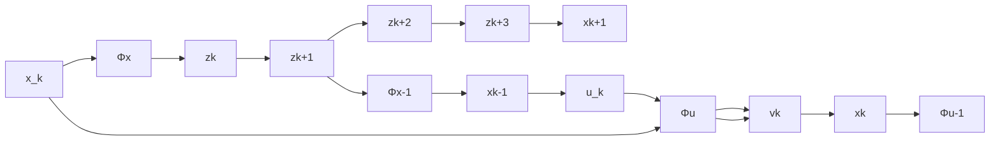

A schematically interpretation of this equation is given in Fig. 2. Since the Brunovsky structure is uniquely defined by the dimension of the state $z _ { k }$ , only the transformations $\Phi _ { x }$ and $\Phi _ { u }$ have to be determined for the approximation of the original system. The existence of these transformations can be traced back to a distribution test, see [12] Algorithm 14.2, where the subsequent determination of the transformation requires the solution of a set of ordinary differential equations. The proposed approach seeks to overcome this burden by implementing the transformations as neural networks and to train them on historical sensor data. This attempts to impose the behavior of the Brunovsky system on the original system. The subsequent trajectory planning and the outer controller do not need the transformations in an analytical form, the implementation as neural networks is sufficient.

flowchart

Fig. 2. Representation of the sampled data system as transformed linear system in Brunovsky canonical form according to (4).
