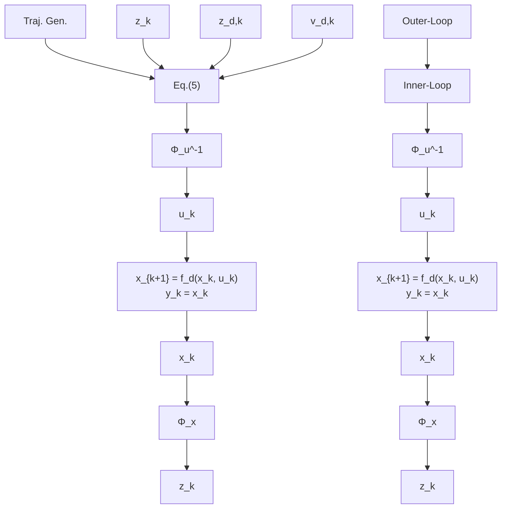

# C. Outer-Loop Controller

The outer-loop controller is designed for the Brunovsky system, with the aim to impose an exponentially stable error dynamic

$$
\left[ \begin{array}{c} e _ {1, k + 1} \\ \vdots \\ e _ {n, k + 1} \end{array} \right] = \left[ \begin{array}{c c c c} 0 & 1 & \dots & 0 \\ \vdots & \vdots & \ddots & \vdots \\ 0 & 0 & \dots & 1 \\ - a _ {0} & - a _ {1} & \dots & - a _ {n - 1} \end{array} \right] \left[ \begin{array}{c} e _ {1, k} \\ \vdots \\ e _ {n, k} \end{array} \right]
$$

for the trajectory error $e _ { 1 } = y _ { 1 } - y _ { 1 , d }$ with the desired target trajectory from Section III-B. The corresponding control law can be deduced as

$$v _ {k} = - \left[ a _ {0}, \dots , a _ {n - 1} \right] \cdot \left(z _ {k} - z _ {d, k}\right) + v _ {d, k} \tag {5}$$

flowchart

Fig. 3. Schematic of the control strategy with inner transformation to Brunovsky canonical form and an outer trajectory controller.

with proper chosen coefficients $a _ { j } , ~ j = 0 , \ldots , n - 1$ . The coefficients correspond to the characteristic polynomial of the error dynamics and can be determined, e.g., by pole placement. The overall control schematic divided in an innerand outer-loop is presented in Fig. 3.
