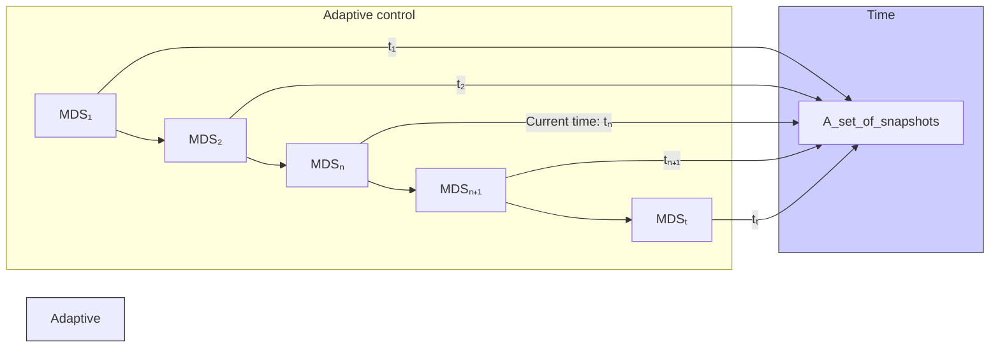

In summary, we make the following contributions:

(1) We propose an adaptive control problem aimed at dynamically adjusting the MDS in real time to maintain control of the network as its topology changes. From the perspective of adaptive control, there is no need for prior knowledge of all network topology changes followed by post analysis. However, adaptive control faces a key challenge: the adjusted MDS may differ significantly from the previous MDS, introducing additional control costs.

(2) We present a new Adaptive Control algorithm (AC) to tackle the fundamental challenges of adaptive control in dynamic networks. The AC algorithm aims to minimize the difference between consecutive MDSs used in the adaptive control of dynamic networks. It selects the most suitable MDS for every consecutive network snapshot, considering its histor ical topological variations and potential future configurations.

The remainder of the paper is structured as follows: Section II introduces the related work of this paper. Section III defines dynamic networks and describes adaptive control. Section IV motivates the research and describes the AC algorithm. Section V presents empirical results on both synthetic and real-world networks, followed by an extended comparative analysis with multiple baseline methods. Finally, Section VI concludes and outlines future directions.

flowchart

Fig. 1. Adaptive control of dynamic networks. At the current time tn, only the previous network topologies [t1,..., tn] are available, while the subsequent network topology is unknown. The goal of adaptive control is to compute the current MDSn in real time to maintain control of the network. As a result, each snapshot will have its own MDS.
