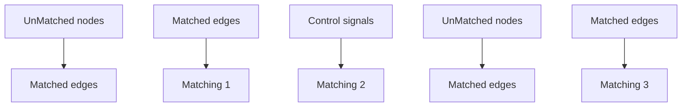

</details>

B


C   


D   


  
Fig. 2. A simple network with three different MDS. (A) A simple network with four nodes and three edges. (B)-(D) Different maximum matching of the network (A). Different maximum matchings may produce different MDSs.

A   


Asample dynamic network G   


<details>
<summary>flowchart</summary>

```mermaid
graph TD
    1 --> 2
    2 --> 3
    3 --> 4
    1 --> 2
    2 --> 3
    3 --> 4
    style 1 fill:#fff,stroke:#000
    style 2 fill:#fff,stroke:#000
    style 3 fill:#fff,stroke:#000
    style 4 fill:#fff,stroke:#000
    note bottom of 1: G₁, MDS₁={V₁,V₂}
```
</details>

MDS sequence with high ECC   


<details>
<summary>flowchart</summary>
