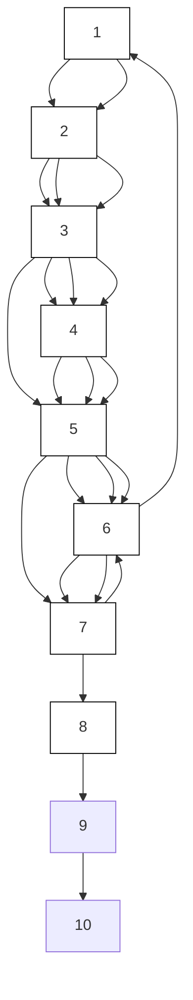

</details>


<details>
<summary>flowchart</summary>

```mermaid
graph TD
    1 --> 2
    1 --> 3
    2 --> 4
    3 --> 5
    3 --> 6
    4 --> 7
    5 --> 7
    6 --> 1
    7 --> 5
    style 1 fill:#FFD700,stroke:#333
    style 2 fill:#FFD700,stroke:#333
    style 3 fill:#FFD700,stroke:#333
    style 4 fill:#FFD700,stroke:#333
    style 5 fill:#FFD700,stroke:#333
    style 6 fill:#FFD700,stroke:#333
    style 7 fill:#FFD700,stroke:#333
    note bottom of 7: G₃, MDS₃={V₁, V₄, V₆}
```
</details>


<details>
<summary>flowchart</summary>

```mermaid
graph TD
    1 --> 2
    2 --> 3
    3 --> 5
    3 --> 6
    5 --> 7
    6 --> 1
    4 --> 2
    7 --> 5
    style 1 fill:#fff,stroke:#000
    style 2 fill:#fff,stroke:#000
    style 3 fill:#fff,stroke:#000
    style 4 fill:#fff,stroke:#000
    style 5 fill:#fff,stroke:#000
    style 6 fill:#fff,stroke:#000
    style 7 fill:#fff,stroke:#000
    note bottom of 5: G4, MDS5={V3, V5}
```
</details>


<details>
<summary>flowchart</summary>

```mermaid
graph TD
    1 --> 2
    2 --> 3
    3 --> 4
    4 --> 5
    5 --> 6
    6 --> 1
    3 --> 8
    8 --> 7
    style 1 fill:#fff,stroke:#000
    style 2 fill:#fff,stroke:#000
    style 3 fill:#fff,stroke:#000
    style 4 fill:#fff,stroke:#000
    style 5 fill:#fff,stroke:#000
    style 6 fill:#fff,stroke:#000
    style 7 fill:#fff,stroke:#000
    style 8 fill:#fff,stroke:#000
    note right of 8: G5, MDS5={V6, V7, V8}
```
</details>

C   


<details>
<summary>flowchart</summary>

```mermaid
graph TD
    1 --> 2
    2 --> 4
    2 --> 3
    3 --> 1
    3 --> 4
    1 --> 3
    2 --> 3
    3 --> 1
    style 1 fill:#fff,stroke:#000
    style 2 fill:#fff,stroke:#000
    style 3 fill:#fff,stroke:#000
    style 4 fill:#fff,stroke:#000
    note bottom of 1: G₁, MDS₁={V₁, V₃}
```
</details>
