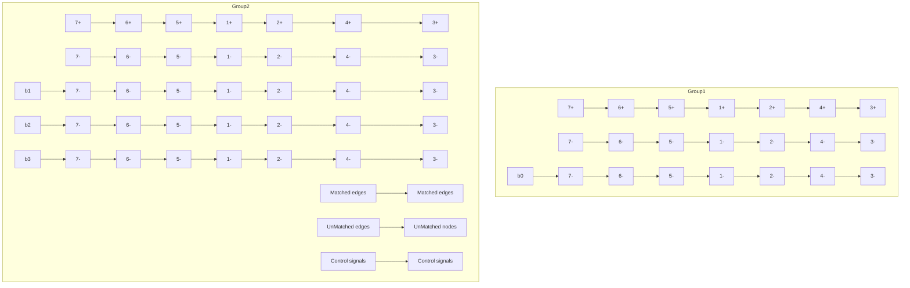

subgraph G4
        1 -->|q1=0.6| 2
        2 -->|q2=0.4| 3
        3 -->|q3=2.8| 5
        5 -->|q5=2.8| 7
        6 -->|q6=0.2| 3
        7 -->|q7=0.2| 7

A --> G1
    B --> G3
    A --> G4
    B --> G4
    G1 --> G2
    G2 --> G3
    G3 --> G4
```
</details>


<details>
<summary>flowchart</summary>


</details>
