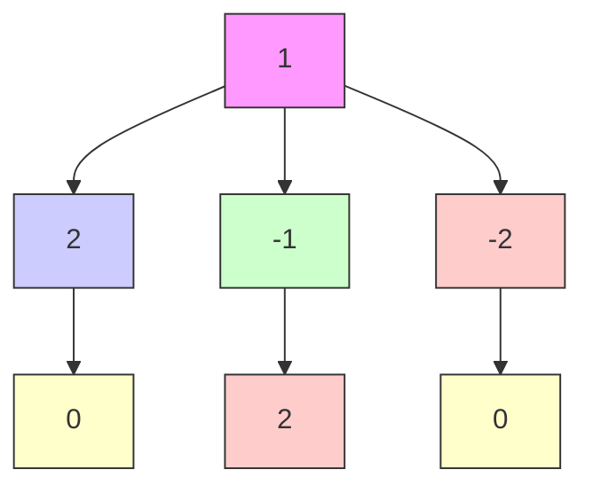

f₀(x₀, -1)
μ({x})
f₀(x₀, +1)
-1
x₀
+1
x

text_image

x
k

flowchart

(a) A deterministic input yields either the dotted or the dashed configuration, but it cannot split the probability mass and yield the solid configuration; see Example 5.2.   
(b) Two switching particles (dashed) yield the optimal configuration from a fleet perspective at all times, oppositely to a fixed allocation (solid); see Counterexample 5.3.   
(c) The noisy drift (dashed) may favor a re-allocation with lower effort (dotted), oppositely to the fixed allocation that yields a larger cost (solid) every second time; see Counterexample 5.4.   
Fig. 2: Depiction of Example 5.2, Counterexample 5.3, and Counterexample 5.4.
