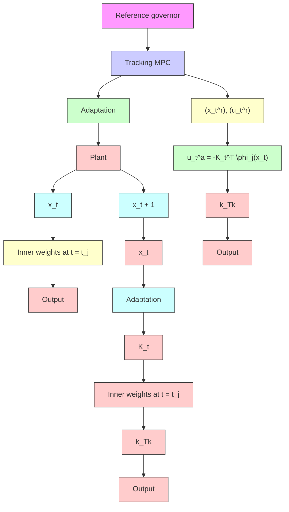

Figure 2: Schematic of DNN in the loop with MPC.

We employ

$$u _ {t} ^ {a} = - K _ {t} ^ {\top} \phi_ {j} (x _ {t}) \tag {19}$$

as an adaptive (learning) control at time $t \in \left\{ t _ { j } , t _ { j } + 1 , \dots , t _ { j + 1 } - 1 \right\}$ , where $K _ { t }$ is the weight of the output layer, which is trained according to the adaptive weight update law and $\phi _ { j }$ is a feature basis function obtained from the last activation layer of DNN after $j ^ { \mathrm { t h } }$ training. In the next subsections we provide the relevant details of the training of DNN.
