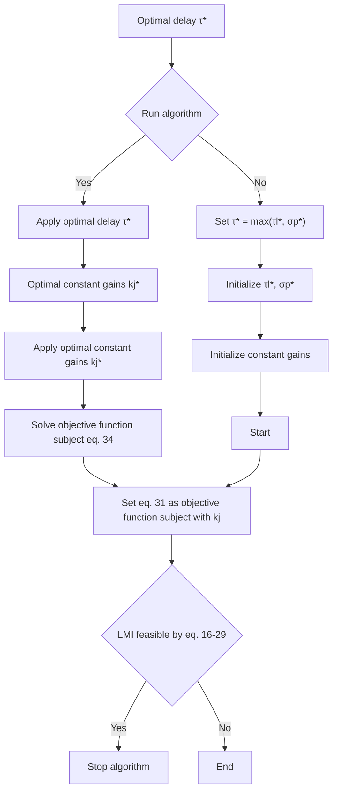

# VI. VERIFICATION OF RESULTS

To test the performance of the proposed protocol (12), we consider here a generic MAS composed by 4 agents plus a leader. The i-th agent dynamics are defined as

$$
\dot {x} _ {i} = \left[ \begin{array}{c c c} 0 & 1 & 0 \\ 0 & 0 & 1 \\ - 1 & - 2 & - 3 \end{array} \right] x _ {i} (t) + \left[ \begin{array}{l} 0 \\ 0 \\ 1 \end{array} \right] u _ {i} (t) \tag {35}
$$

and the leader dynamic is considered as

$$
\dot {x} _ {0} = \left[ \begin{array}{c c c} 0 & 1 & 0 \\ 0 & 0 & 1 \\ - 1 & - 2 & - 3 \end{array} \right] x _ {0} (t) \tag {36}
$$

flowchart

Fig. 1. Process flow diagram of the developed optimization algorithm.

Algorithm 1: Optimization algorithm   
- Initialize constant gains $k_{ij}$ .
- Given upper bound of time delays as $\tau_l^\star$ and $\sigma_g^\star$ .
- Consider $\tau^\star = \max \{ \tau_l^\star, \sigma_g^\star \}$ .

repeat
  - Solve the LMIs feasibility problem (16)-(29) with $\tau^\star$ .
  - Estimation of the maximum admissible delays according to (31).
  - Check the LMIs feasibility problem (16)-(29) according to the obtained maximum delay.
if LMIs problem (16)-(29) are not feasible then
    - Break.
else
    - Solve objective function (33) subject to (34).
    - Apply optimal constant gains $k_{ij}^\star$ and optimal delay $\tau^\star$ to LMI problems.
end
  - Return optimal constant gains $k_{ij}^\star$ .
  - Return maximum delay $\tau^\star$ .

until LMIs problem (16)-(29) be feasible.;

According to Routh–Hurwitz stability, φi in (60) is negative if the following condition satisfies

$$\gamma_ {3} \cdot \gamma_ {2} > \gamma_ {1} \tag {37}$$

From (61) and (35), (37) can be recast as

$$k _ {i 0, 1} - 2 k _ {i 0, 2} - 3 k _ {i 0, 3} - k _ {i 0, 2} \cdot k _ {i 0, 3} < 0 \tag {38}$$

The communication topology G is chosen in accordance to the following adjacency matrix
