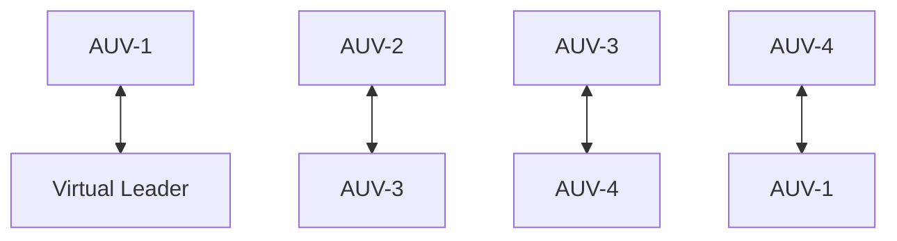

The selected parameters, which were chosen based on a trial-and-error procedure, for the proposed controller in this simulation are $k _ { 1 } = k _ { 8 } = 5 , k _ { 2 } = k _ { 3 } = k _ { 9 } = k _ { 1 0 } = 0 . 4 { \mathrm { , } }$ $w _ { 1 } = w _ { 2 } = 1 , \beta _ { s } = 2 0$ . The parameters $\gamma = 5 / 7$ and $\iota = 7 / 5$ . The control efforts are saturared by $\tau _ { \mathrm { m a x } } ~ = ~ 3 0 0 N m$ . The proposed controller uses the below membership functions, which were tuned based on a trial-and-error procedure:

$$
\begin{array}{l} \mu_ {A _ {i} ^ {1}} \quad = \quad \exp \left(- (Z _ {i} + 7) ^ {2} / 4\right), \mu_ {A _ {i} ^ {2}} \quad = \\ \exp \left(- (Z _ {i} + 5) ^ {2} / 4\right), \mu_ {A _ {i} ^ {3}} = \exp \left(- (Z _ {i} + 3) ^ {2} / 4\right), \mu_ {A _ {i} ^ {4}} = \\ \exp \left(- (Z _ {i} + 1) ^ {2} / 4\right), \mu_ {A _ {i} ^ {5}} = \exp \left(- (Z _ {i} + 0) ^ {2} / 4\right), \mu_ {A _ {i} ^ {6}} = \\ \exp \left(- (Z _ {i} - 1) ^ {2} / 4\right), \mu_ {A _ {i} ^ {7}} = \exp \left(- (Z _ {i} - 3) ^ {2} / 4\right), \mu_ {A _ {i} ^ {8}} = \\ \exp \left(- (Z _ {i} - 5) ^ {2} / 4\right), \mu_ {A _ {i} ^ {9}} = \exp \left(- (Z _ {i} - 7) ^ {2} / 4\right). \\ \end{array}
$$

The input of the FLC is $Z _ { i } = [ \eta _ { i } , v _ { i } ] ^ { T }$ . To reduce chattering, the controller (58) is used and $\epsilon _ { 1 } = 0 . 0 1$ .

In order to highlight the superior performance of the proposed controller, it is analysed in a comparison with the distributed SMC [16]. The SMC can be designed as in Appendix A. The sliding gain of the SMC is selected as $\beta _ { 0 } ~ = ~ 2 0 0$ . Note that the SMC [16] has not considered the effects of the input saturation in the design. The tracking performances of the proposed controller are shown in Figs. 2, 3, 4, 5, while the performances of the SMC are shown in Figs. 6, 7, 8, 9. In particular, Fig. 2 shows the formation shape of the four AUVs under the proposed controller. Compared with the formation shape of the AUVs under the SMC controller shown in Fig. 6, the proposed controller provides faster and smoother

flowchart

Fig. 1. The communication topology graph for 3 AUVs formation control
