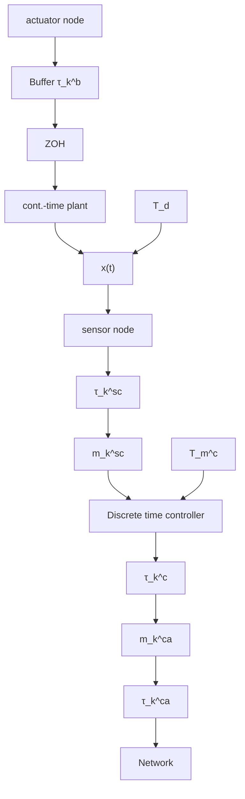

In this paper, we propose an LMI-based control strategy suitable for NCS affected by variable time delays and packet dropouts motivated by [5] but with a special focus on the reduction of the complexity of the method. The simplification of the NCS model is achieved by a specific buffering mechanism [9], which significantly reduces additional buffer delays in comparison to the worst-case scenario from [6]. The resulting buffered NCS can be therefore formulated as a switched system, for which an extensive literature related to LMI-based control design is available, see, e.g., [10], [11], [12]. This represents a crucial step toward the computational simplicity, since it circumvents the need for overapproximation techniques and strongly reduces the number of optimization variables and resulting LMIs. Furthermore, the significant reduction of the algorithms’ complexity allows the introduction of the additional degrees of freedom, which can be used to influence the transient behavior of the system, increasing the practical usability of the strategy. The proposed control laws are compared to the control law from [5] in simulations on the basis of TrueTime [13] with respect to their performance and computational complexity.

flowchart

Fig. 1. Considered buffered networked control system
