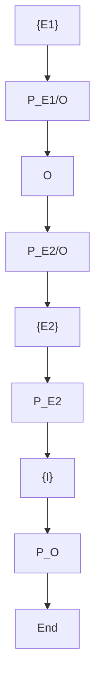

Thirdly, we propose an adaptive control protocol for the trajectory tracking by an observable point on an object that is manipulated by N robotic agents in terms of rolling contacts, also without using force/torque measurements at the grasping points. We develop a centralized as well as a decentralized event-triggered communication-based control scheme. Both schemes include the adaptive and quaternion modeling attributes of the rigid grasp schemes, and are robust to uncertainties of the object’s center of mass pose, since the tracking concerns an observable a priori selected point on the object. Novel algorithms that guarantee contact slip avoidance are also developed. We provide detailed stability analyses for all the proposed schemes, whose validity is verified by using simulation and experimental results.

flowchart

Figure 2.1: Two robotic agents rigidly grasping an object.
