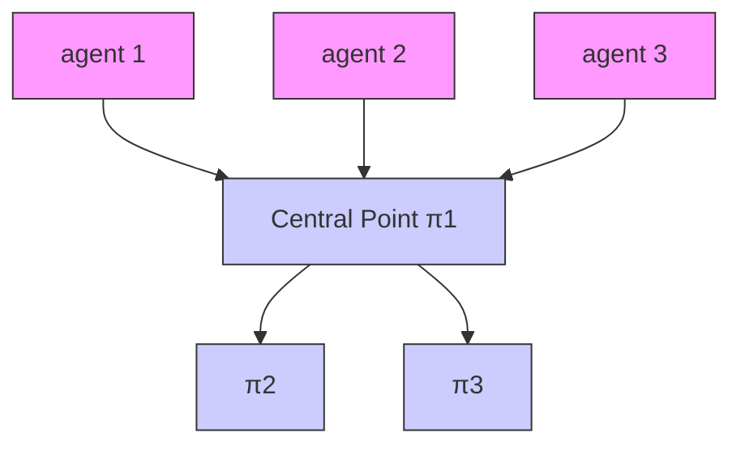
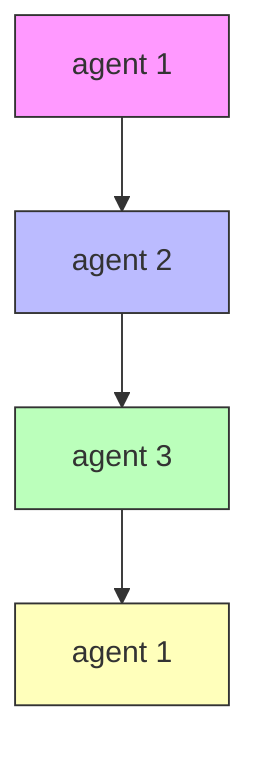

# Hybrid Control Framework

Due to the proposed continuous control protocol, the transitions $( \pi _ { k _ { i } } , t _ { 0 } ) \stackrel { i } {  }$ $\left( \pi _ { k _ { i } ^ { \prime } } , t _ { f _ { i } } \right)$ of Problem 5.2 are well-defined, according to Def. 5.8. Moreover, since all the agents $i \in \mathcal N$ remain connected with the subset of their initial neighbors $\widetilde { \mathcal { N } } _ { i }$ and there exist finite constants $t _ { f _ { i } }$ , such that $\mathcal { A } _ { i } ( q _ { i } ( t _ { f _ { i } } ) ) \in$ $\pi _ { k _ { i } ^ { \prime } } , \forall i \in \mathcal { N }$ all the agents are aware of their neighbors state, when a transition is performed. Hence, the transition system (5.6) is well defined, $\forall i \in \mathcal N$ . Consider, therefore, that $A _ { i } ( q _ { i } ( 0 ) ) \in \pi _ { k _ { i , 0 } } , k _ { i , 0 } \in \mathcal { K } _ { \mathcal { R } } , \forall i \in \mathcal { N }$ , as well as a given desired path for each agent, that does not violate the connectivity condition of Problem 5.2. Then, the iterative application of the control protocol (5.7) for each transition of the desired path of agent i guarantees the successful execution of the desired paths, with all the closed loop signals being bounded.

text_image

π₃
2 2
π₁
2 2
π₂
2 2
π₃
2 2
π₂
2 2
vₖ = 2 max{dₖᵢ} + r̄(3,d̄ᵢ) = 4m

(a)

flowchart

(b)

flowchart

