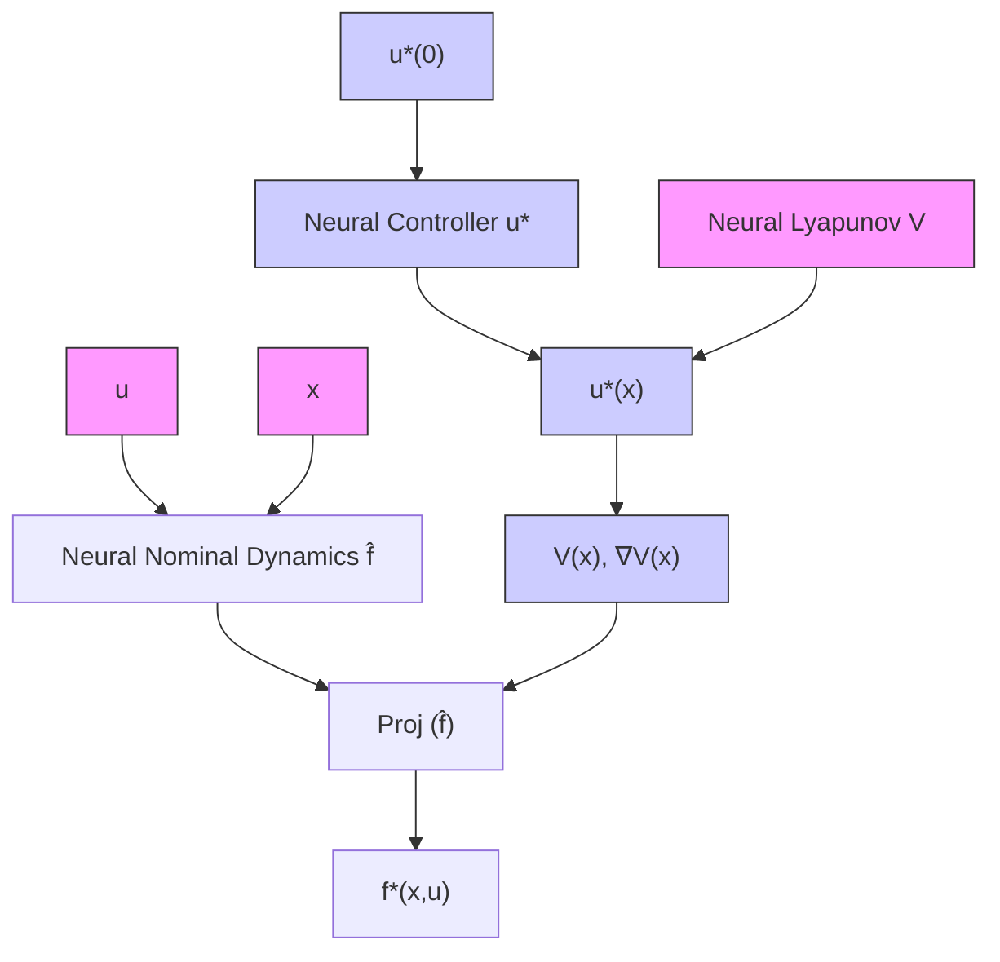

# III. JOINT LEARNING OF DYNAMICS, CONTROLLER AND LYAPUNOV FUNCTION

In this paper, we propose a novel architecture shown in Figure 1 that satisfies the Lyapunov stability conditions by construction. Given the difficulty, if not infeasibility, of synthesizing a Lyapunov function for a separately learned dynamics model, we instead consider jointly learning them. Specifically, we propose a parameterization of the dynamics model that incorporates a given parametric Lyapunov function and controller. This connection allows us to jointly optimize them by applying automatic differentiation from a single loss function to fit the dataset.

More specifically, we construct the dynamics model $f ^ { * }$ by projecting a parametric nominal model ${ \hat { f } } : { \mathcal { X } } \times { \mathcal { U } }  { \bar { \mathbb { R } } } ^ { n }$ according to a parametric Lyapunov function $V : \mathcal { X } $ R and a parametric feedback controller $u ^ { * } : \mathcal { X }  \mathcal { U } .$ . This projection constrains the dynamics model $f ^ { * }$ to satisfy the Lyapunov stability condition

flowchart

Fig. 1. Schematic diagram of CoILS. It projects the nominal dynamics model fˆ to satisfy the stability by construction through incorporating the feedback controller $u ^ { * }$ and the Lyapunov function $V$ in the architecture.

$$\nabla_ {f _ {u ^ {*}} ^ {*}} V (x) = \nabla V (x) ^ {\top} f ^ {*} (x, u ^ {*} (x)) \leq - \alpha V (x) \tag {5}$$

for all $x \in \mathcal { X } \setminus \{ 0 \}$ with a given $\alpha > 0$ . The construction of the dynamics model is as follows.

$$
f ^ {*} (x, u) = \left\{ \begin{array}{l l} \hat {f} (x, u) & \text { if } x = 0 \\ \operatorname{Proj} _ {u ^ {*} (x), V (x), \nabla V (x)} (\hat {f} (x, \cdot)) (u) & \text { o.w. } \end{array} \right. \tag {6}
$$

where
