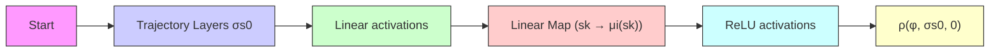

# 4.1 Trapezium feed-forward Neural Network (TNN)

flowchart

Fig. 1: The structure of TNN (that encodes the computation of the trajectory $\sigma _ { \mathbf { s } _ { 0 } }$ starting from initial state ${ \bf s } _ { 0 } )$ composed with STL2NN (that encodes the computation of the robustness of the STL formula $\varphi$ w.r.t. $\sigma _ { \mathbf { s } _ { 0 } } )$ .

Recall the dynamical system from (1), we can rewrite it simply as $\mathbf { s } _ { k + 1 } =$ $\mathbf { f } ( \mathbf { s } _ { k } , \eta ( \mathbf { s } _ { k } ) )$ . From this equation, we construct a neural network that we call the trapezium feed forward neural network. The name is derived from the shape in which we arrange the neurons. The input to TNN is the initial state $\mathbf { s } _ { 0 }$ . TNN has K blocks, where for $k \geq 1$ , the output of the $k - 1 ^ { t h }$ block is $\left[ \mathbf { s } _ { 0 } \cdots \mathbf { s } _ { k - 1 } \right]$ . The $k ^ { t h }$ block essentially takes the k outputs of the previous block and $^ { 6 } \mathrm { c o p i e s } ^ { 5 }$ them to the block output using neuron layers that implement identity maps. The $( k + 1 ) ^ { t h }$ output of the block is the computation of $\mathbf { s } _ { k + 1 }$ using the difference equation stated above. Thus, TNN has a shape where each subsequent block has an equal number of additional number of neurons (equal to the dimension of the state variable). The output of the $K ^ { t h }$ block can be then passed off to the input of STL2NN. Recall that the output of STL2NN is a single real number representing the robustness value of $\varphi$ w.r.t. the trajectory $\sigma _ { \mathbf { s } _ { 0 } }$ . We pictorially represent this in Fig. 1. We remark that this structure is important and has a non-trivial bearing on the verification methods that we develop in this paper as we observe later. TNN thus encodes a function $\mathcal { R } _ { \varphi } : \mathbb { R } ^ { n }  \mathbb { R }$ , where,

$$\mathcal {R} _ {\varphi} (\mathbf {s} _ {0}) = \rho (\varphi , \sigma_ {\mathbf {s} _ {0}}, 0).$$

Given a TNN, we can use it to solve the problem outlined in (4). In rest of this section, we show how we can use a generic neural network reachability analyzer to perform STL verification.
