The system can be viewed as an open-loop exponential growth system $\begin{array} { r } { \frac { d y } { d t } = b y ( t ) } \end{array}$ whe $d ( t )$ $r ( t )$ represent the $\boldsymbol { r } ( t ) - \boldsymbol { y } ( t )$ $l r ( t ) - y ( t )$ proportional-integral feedback is $s z ( t ) ( l r ( t ) - y ( t ) )$ , where $s z ( t )$ is considered as the adaptive proportional-integral gain. In control theory, a reference input refers to an input signal that guides the system response. Typically, the goal is to make the response $y ( t )$ track the reference input $r ( t )$ , such that the error term is zero $( r ( t ) - y ( t ) = 0 )$ at the equilibrium point. Furthermore, since we consider this equation in the context of biological phenomena, all parameters are assumed positive. This implies that $b , s , l ,$ and c are all positive, and for every $t > 0 ,$ , all $y ( t ) , z ( t )$ , and $r ( t )$ > are positive. The block diagram of the adaptive proportional-integral system is illustrated in Fig. 1.

To verify the DC property of our model, the system should be at an equilibrium point before being perturbed by any input. When a system is at an equilibrium point, its value does not change with time. We then triggered the system with a step-like input $r ( t )$ to sketch the response $y ( t )$ . We adjust the value of each parameter in Eqs. 4a and 4b to observe how they affect the system. The stability region is discovered by drawing the phase portrait.

```mermaid
graph TD
    A["r(t)"] --> B["l"]
    B --> C["Σ"]
    C --> D["θ(t)"]
    D --> E["u_c(t)"]
    E --> F["\frac{dy(t)}{dt} = by(t) + d(t) + u_c(t)"]
    F --> G["y(t)"]
    G --> H["Σ"]
    H --> I["r(t) - y(t)"]
    I --> J["s"]
    J --> K["z(t)"]
    K --> L["\frac{dz(t)}{dt} = -cz(t)(r(t) - y(t))"]
    L --> M["d(t)"]
    M --> N["\frac{dy(t)}{dt} = by(t) + d(t) + u_c(t)"]
    N --> O["y(t)"]
    O --> P["Σ"]
    P --> Q["-"]
    Q --> R["r(t) - y(t)"]
    R --> S["s"]
    S --> T["\frac{dz(t)}{dt} = -cz(t)(r(t) - y(t))"]
    T --> U["d(t)"]
    U --> V["\frac{dy(t)}{dt} = by(t) + d(t) + u_c(t)"]
    V --> W["y(t)"]
    W --> X["Σ"]
    X --> Y["-"]
    Y --> Z["r(t) - y(t)"]
    Z --> AA["s"]
    AA --> AB["z(t)"]
    AB --> AC["\frac{dz(t)}{dt} = -cz(t)(r(t) - y(t))"]
    AC --> AD["d(t)"]
    AD --> AE["\frac{dy(t)}{dt} = by(t) + d(t) + u_c(t)"]
    AE --> AF["y(t)"]
```

flowchart

Figure 1: Block diagram shows the adaptive proportional-integral feedback $s z ( t ) ( l r ( t ) - y ( t ) )$  where $s z ( t )$ is the adaptive proportional-integral gain with two error terms $\boldsymbol { r } ( t ) - \boldsymbol { y } ( t )$ and $l r ( t ) - y ( t )$ . Term d(t) represents the disturbance.
